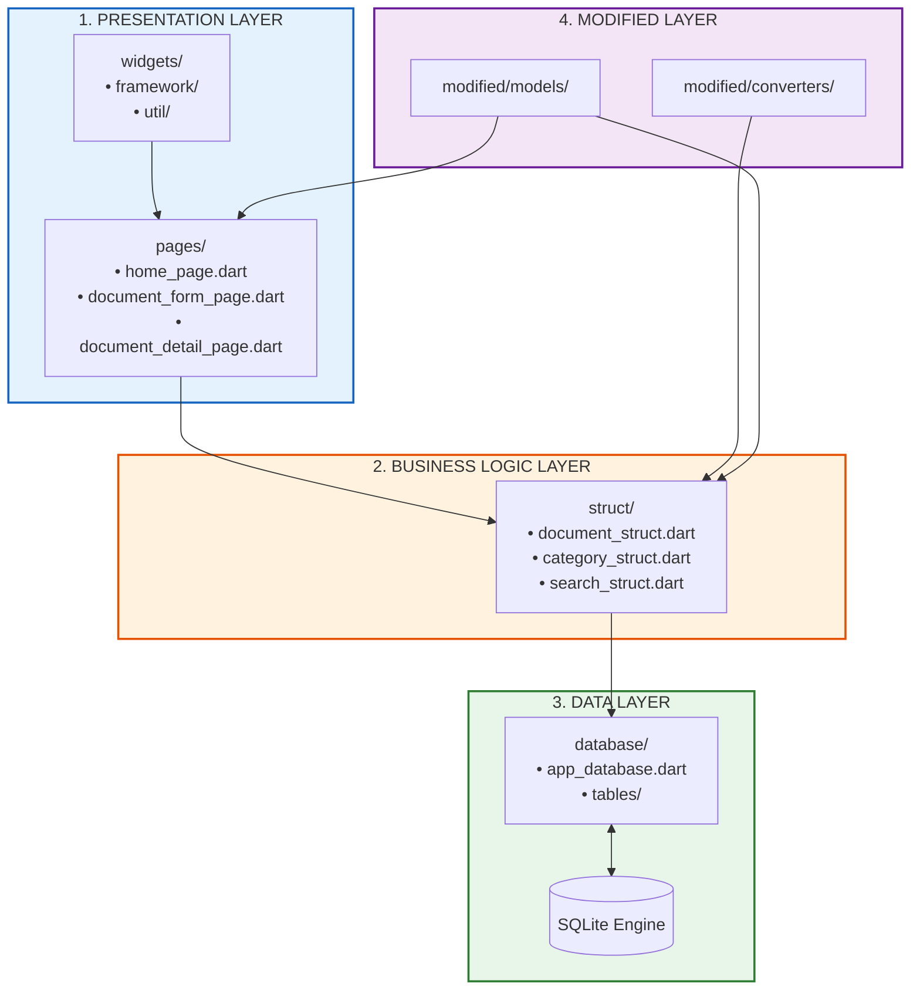
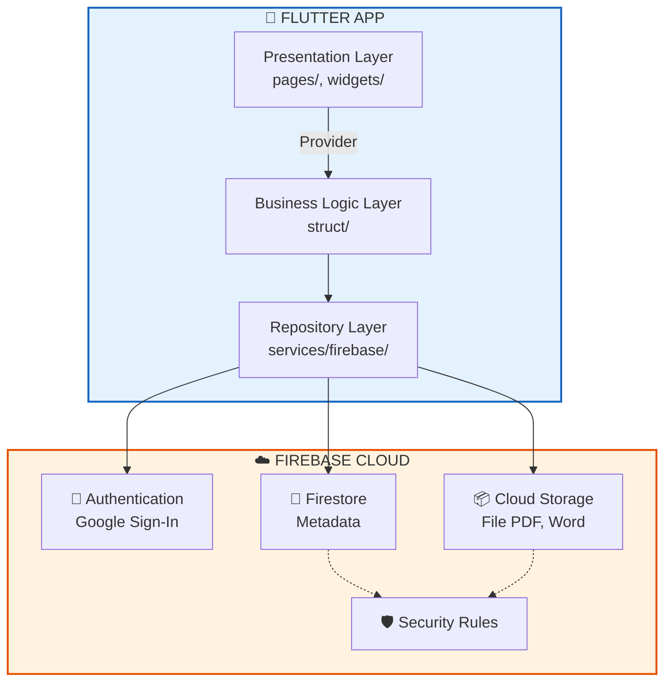
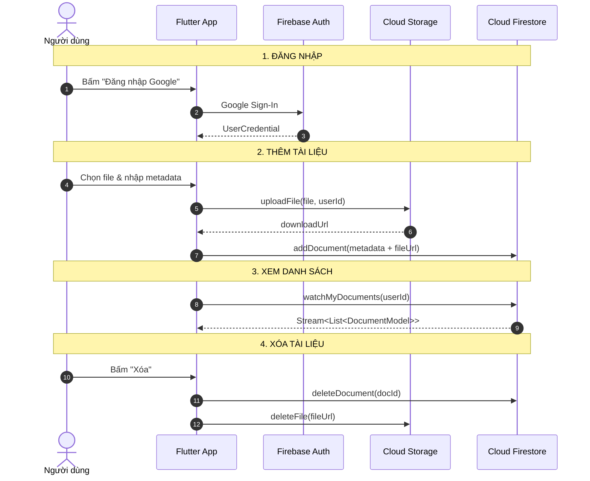
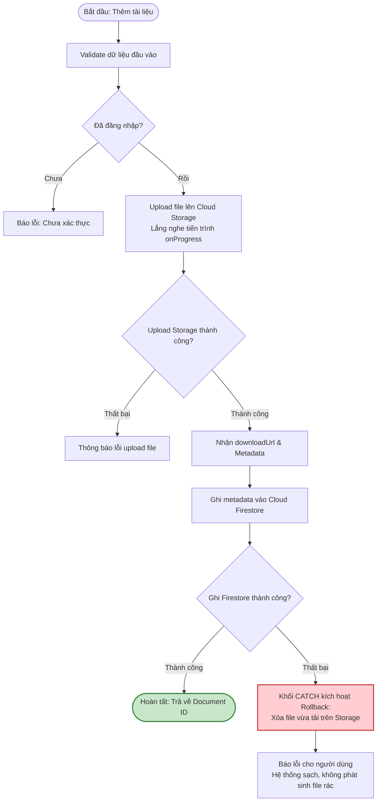
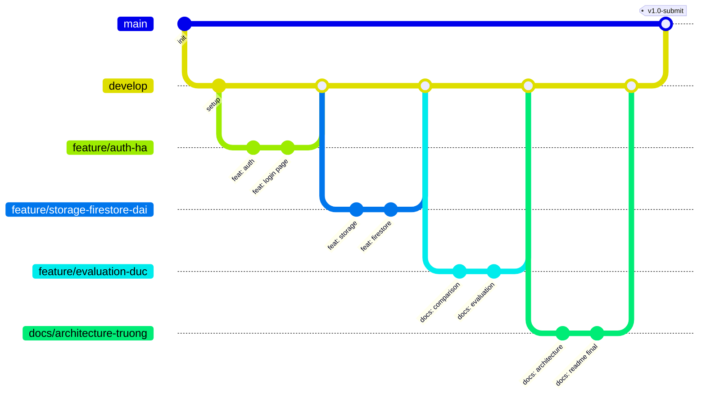

# 📚 StudyDocs Cloud - Tích hợp điện toán đám mây cho Hệ thống Quản lý Tài liệu

> Bài tập nhóm: Phân tích và tích hợp Cloud (Firebase) vào ứng dụng Flutter quản lý tài liệu học tập **StudyDocs**.
>
> **Nhóm 4 thành viên**: Nguyễn Thế Trưởng (Leader), Hàn Hoàng Hà, Nguyễn Đăng Đại, Phương Văn Đức.

---

## 📖 Mục lục

1. [Giới thiệu](#1--giới-thiệu)
2. [Phân tích các thành phần cốt lõi](#2--phân-tích-các-thành-phần-cốt-lõi-của-hệ-thống-hiện-tại)
3. [Điểm nghẽn của hệ thống truyền thống](#3--điểm-nghẽn-của-hệ-thống-truyền-thống)
4. [Lựa chọn mô hình Cloud & dịch vụ](#4--lựa-chọn-mô-hình-cloud--dịch-vụ)
5. [So sánh mô hình truyền thống vs. Cloud](#5--so-sánh-mô-hình-truyền-thống-vs-cloud)
6. [Kiến trúc tích hợp Cloud & luồng dữ liệu](#6--kiến-trúc-tích-hợp-cloud--luồng-dữ-liệu)
7. [Hướng dẫn setup Firebase với Flutter](#7--hướng-dẫn-setup-firebase-với-flutter)
8. [Code mẫu tích hợp](#8--code-mẫu-tích-hợp)
9. [Đánh giá tác động: Bảo mật, Chi phí, Hiệu suất](#9--đánh-giá-tác-động-bảo-mật-chi-phí-hiệu-suất)
10. [Slide tìm hiểu Firebase](#10--slide-tìm-hiểu-firebase--cách-setup)
11. [🌿 Chiến lược Branch & Phân công chi tiết](#11--chiến-lược-branch--phân-công-chi-tiết)
12. [🔄 Quy trình Pull / Merge / Review](#12--quy-trình-pull--merge--review)
13. [Timeline & Hướng dẫn chạy](#13--timeline--hướng-dẫn-chạy)

---

## 1. 🎯 Giới thiệu

**StudyDocs** là ứng dụng Flutter quản lý tài liệu học tập, ban đầu được xây dựng theo **Kiến trúc Cashew phiên bản rút gọn** (Offline-first, Drift ORM + SQLite, Provider).

**Mục tiêu bài tập**: Phân tích hệ thống hiện tại và đề xuất phương án tích hợp **Firebase** nhằm:
- Tối ưu hóa lưu trữ (thay vì chỉ lưu cục bộ).
- Tăng cường bảo mật (xác thực người dùng).
- Cho phép truy cập từ xa và đồng bộ đa thiết bị.

---

## 2. 🏗️ Phân tích các thành phần cốt lõi

### 2.1. Sơ đồ kiến trúc hiện tại



### 2.2. Bảng phân tích thành phần

| Thành phần | Vị trí | Vai trò | Công nghệ |
|---|---|---|---|
| **Frontend (UI)** | `lib/pages/`, `lib/widgets/` | Hiển thị danh sách, form, tìm kiếm, lọc | Flutter, Provider |
| **Business Logic** | `lib/struct/` | CRUD, validation, tìm kiếm | Dart thuần |
| **Database** | `lib/database/` | Lưu metadata tài liệu | Drift, SQLite |
| **File Storage** | Bộ nhớ thiết bị | Lưu file PDF, Word... | File System |
| **Models & Converters** | `lib/modified/` | DTO thuần Dart | Dart thuần |
| **Testing** | `test/` | Unit test với in-memory DB | Flutter Test |

> **Điểm mấu chốt**: Hệ thống hiện tại **chưa có Backend**, **chưa có xác thực**, dữ liệu hoàn toàn **cục bộ**.

---

## 3. ⚠️ Điểm nghẽn của hệ thống truyền thống

| # | Hạn chế | Hệ quả |
|---|---|---|
| 1 | Không truy cập từ xa | Không thể xem từ máy khác |
| 2 | Không đồng bộ đa thiết bị | Nhiều người không cùng quản lý được |
| 3 | Rủi ro mất dữ liệu | Mất thiết bị = mất toàn bộ |
| 4 | Không có xác thực | Ai mở app đều thấy hết |
| 5 | Khó chia sẻ | Không chia sẻ được giữa thành viên |
| 6 | Giới hạn dung lượng | Bộ nhớ thiết bị hữu hạn |
| 7 | Không có versioning | Không theo dõi lịch sử thay đổi |

---

## 4. ☁️ Lựa chọn mô hình Cloud & dịch vụ

### 4.1. So sánh các mô hình triển khai

| Tiêu chí | Public Cloud | Private Cloud | Hybrid Cloud |
|---|---|---|---|
| Chi phí ban đầu | Thấp | Cao | Trung bình |
| Độ phức tạp setup | Thấp | Cao | Trung bình |
| Khả năng mở rộng | Rất cao | Hạn chế | Cao |
| Bảo mật | Nhà cung cấp quản lý | Tự quản lý | Kết hợp |
| Phù hợp bài tập | ✅ Rất phù hợp | ❌ Quá phức tạp | ⚠️ Không cần |

### 4.2. Quyết định: **Public Cloud với Firebase (Google Cloud Platform)**

**Lý do lựa chọn:**
- Miễn phí ở mức cơ bản (Spark Plan).
- Tích hợp sẵn Authentication, Firestore, Cloud Storage.
- Hỗ trợ Flutter chính thức qua FlutterFire CLI.
- Offline persistence tích hợp sẵn.
- Tài liệu phong phú, cộng đồng lớn.

### 4.3. Các dịch vụ Firebase sẽ sử dụng

| Dịch vụ | Thay thế/bổ sung | Mục đích |
|---|---|---|
| **Firebase Authentication** | Chưa có | Đăng nhập Google |
| **Cloud Firestore** | SQLite (Drift) | Lưu metadata, offline + real-time sync |
| **Cloud Storage** | File cục bộ | Lưu file PDF, Word... |
| **Security Rules** | Chưa có | Kiểm soát truy cập |

---

## 5. 🔄 So sánh mô hình truyền thống vs. Cloud

| Tiêu chí | Truyền thống | Sau tích hợp Firebase |
|---|---|---|
| Lưu metadata | SQLite cục bộ | Firestore (cloud + cache) |
| Lưu file | Bộ nhớ thiết bị | Cloud Storage |
| Xác thực | ❌ Không | ✅ Firebase Auth |
| Truy cập từ xa | ❌ Không | ✅ Có |
| Đồng bộ đa thiết bị | ❌ Không | ✅ Real-time sync |
| Backup | ❌ Không | ✅ Tự động |
| Chia sẻ | ❌ Không | ✅ Qua Firestore rules |
| Chi phí | 0đ (rủi ro) | 0đ với Spark Plan |
| Bảo mật | ❌ Không | ✅ Security Rules + Auth |

---

## 6. 🏛️ Kiến trúc tích hợp Cloud & luồng dữ liệu

### 6.1. Sơ đồ kiến trúc tích hợp



### 6.2. Sơ đồ ASCII

```text
+-------------------------------------------------------------------------+
|                          📱 FLUTTER APP                                 |
|  PRESENTATION (pages/, widgets/)                                        |
|       |                                                                 |
|       v                                                                 |
|  BUSINESS LOGIC (struct/)                                               |
|       |                                                                 |
|       v                                                                 |
|  REPOSITORY (services/firebase/)                                        |
+------------------------------------+------------------------------------+
                                     | HTTPS / SDK
                                     v
+-------------------------------------------------------------------------+
|                          ☁️ FIREBASE CLOUD                              |
|  +----------------+  +----------------+  +----------------+              |
|  | Authentication |  |   Firestore    |  | Cloud Storage  |              |
|  | Google Sign-In |  |  (Metadata)    |  |  (File PDF)    |              |
|  +----------------+  +----------------+  +----------------+              |
|         ^                    ^                    ^                     |
|         +--------------------+--------------------+                     |
|                              |                                          |
|                    +------------------+                                 |
|                    | Security Rules   |                                 |
|                    +------------------+                                 |
+-------------------------------------------------------------------------+
```

### 6.3. Luồng dữ liệu



### 6.4. Luồng dữ liệu theo chức năng

| Chức năng | Luồng |
|---|---|
| **Đăng nhập** | User → Google Sign-In → Firebase Auth → userId |
| **Thêm** | Chọn file → Upload Storage → downloadUrl → Firestore metadata |
| **Xem DS** | Query Firestore theo ownerId → Stream → StreamBuilder |
| **Tìm kiếm** | Query Firestore where title/type/subject |
| **Sửa** | Update Firestore → Stream tự động phát |
| **Xóa** | Delete Firestore + xóa file Storage |

### 6.5. Thiết kế Cơ sở dữ liệu Cloud Firestore (Data Schema & Indexing)

> **Người thiết kế & phụ trách:** Nguyễn Đăng Đại

Toàn bộ thông tin tài liệu được quản lý tập trung trong Root Collection `documents`:

#### Bảng cấu trúc trường dữ liệu (Collection `documents`):

| Trường (Field) | Kiểu dữ liệu | Bắt buộc | Mô tả & Ràng buộc |
|---|---|:---:|---|
| `id` | `String` | Có | ID của Document do Firestore tự tạo hoặc UUID |
| `title` | `String` | Có | Tiêu đề tài liệu (1 - 200 ký tự) |
| `description` | `String` | Không | Mô tả tóm tắt nội dung tài liệu |
| `type` | `String` | Có | Phân loại tài liệu: `lecture` (Bài giảng), `exercise` (Bài tập), `reference` (Tham khảo) |
| `subject` | `String` | Có | Tên môn học (vd: Lập trình di động, Giải tích...) |
| `filePath` | `String` | Không | Đường dẫn file trên thiết bị ban đầu (nếu có) |
| `fileUrl` | `String` | Có | URL tải xuống bảo mật từ Cloud Storage |
| `ownerId` | `String` | Có | UID người sở hữu từ Firebase Authentication (`request.auth.uid`) |
| `fileSize` | `Number (int)` | Không | Kích thước file tính bằng bytes (phục vụ thống kê dung lượng) |
| `categoryId` | `String` | Không | ID danh mục mở rộng |
| `createdAt` | `Timestamp` | Có | Thời gian tạo trên server (`FieldValue.serverTimestamp()`) |
| `updatedAt` | `Timestamp` | Có | Thời gian cập nhật gần nhất (`FieldValue.serverTimestamp()`) |

#### Cấu hình Composite Indexes trên Firestore:
Để phục vụ truy vấn thời gian thực và lọc tài liệu nhanh chóng theo từng người dùng, các Composite Index sau được thiết lập:
1. `ownerId` (Ascending) + `updatedAt` (Descending): Dùng cho màn hình danh sách tài liệu cá nhân mới nhất.
2. `ownerId` (Ascending) + `type` (Ascending) + `updatedAt` (Descending): Dùng cho bộ lọc theo loại tài liệu (Bài giảng / Bài tập / Tham khảo).
3. `ownerId` (Ascending) + `subject` (Ascending) + `updatedAt` (Descending): Dùng cho bộ lọc theo môn học.

---

### 6.6. Thiết kế Cấu trúc Lưu trữ Cloud Storage

> **Người thiết kế & phụ trách:** Nguyễn Đăng Đại

#### Cấu trúc cây thư mục (Bucket Hierarchy):
```text
gs://<firebase-storage-bucket>/
└── documents/
    └── {userId}/                         <-- Phân vùng riêng theo UID người dùng
        ├── 1712658900000_de_cuong_toan.pdf
        ├── 1712659120000_slide_flutter_tuan1.pptx
        └── 1712659340000_bai_tap_tuan3.docx
```

#### Quy chuẩn đặt tên và kiểm soát:
1. **Phân vùng người dùng (`userId`):** Mỗi người dùng chỉ có quyền ghi/đọc trong thư mục chứa UID của chính họ, tương thích trực tiếp với Firebase Storage Rules:
   ```javascript
   match /documents/{userId}/{allPaths=**} {
     allow read, write: if request.auth != null && request.auth.uid == userId;
   }
   ```
2. **Quy tắc đặt tên file duy nhất:** `${timestamp}_${sanitizedFileName}` nhằm ngăn ngừa hiện tượng ghi đè khi người dùng upload nhiều file có tên trùng nhau ở các thời điểm khác nhau.
3. **MIME Type Detection:** Tự động gán metadata `contentType` tương ứng (`application/pdf`, `image/png`, `application/vnd.openxmlformats-officedocument.wordprocessingml.document`...) để trình duyệt và app mở file chính xác.
4. **Giới hạn kích thước:** Giới hạn file tối đa **20MB** để đảm bảo tối ưu chi phí Cloud Storage Spark Plan và hiệu năng đường truyền di động.

---

### 6.7. Luồng Giao dịch Bù trừ (Rollback & Anti-Orphaned Files)

> **Vấn đề kỹ thuật:** Quá trình tải tài liệu lên Cloud gồm 2 thao tác độc lập:
> 1. Upload file vật lý lên Cloud Storage.
> 2. Ghi metadata chứa `downloadUrl` vào Cloud Firestore.
>
> Nếu bước 1 thành công nhưng bước 2 gặp lỗi (mất mạng đột ngột, lỗi xác thực Firestore Rules), file trên Storage sẽ bị bỏ rơi (**Orphaned File**), gây lãng phí dung lượng lưu trữ đám mây.

#### Quy trình xử lý Rollback trong `CloudDocumentStruct`:



---

### 6.8. Cơ chế Đồng bộ Ngoại tuyến (Offline Persistence) & Cache Sync

1. **Local Cache Engine:**
   * Cloud Firestore SDK tích hợp sẵn bộ nhớ đệm cục bộ (SQLite trên Android/iOS, IndexedDB trên Web).
   * Khi ứng dụng mở, Firestore tự động đọc dữ liệu từ local cache trước để hiển thị giao diện tức thì (zero latency), sau đó kết nối mạng và kéo dữ liệu mới nhất (delta sync).
2. **Hàng đợi ghi ngoại tuyến (Offline Write Queue):**
   * Nếu người dùng tạo hoặc sửa tài liệu khi mất kết nối mạng, thao tác ghi được ghi nhận ngay vào Local Cache và giao diện cập nhật lập tức (`hasPendingWrites == true`).
   * Khi thiết bị có mạng trở lại, SDK tự động đẩy các thay đổi trong hàng đợi lên máy chủ Google mà không cần người dùng thao tác lại.

---

### 6.9. Phân lớp Kiến trúc Tích hợp (Architectural Layering)

Mô hình tích hợp tuân thủ chặt chẽ kiến trúc phân lớp sạch (Clean Architecture / Cashew):

```text
┌────────────────────────────────────────────────────────┐
│ 1. PRESENTATION LAYER (Flutter UI)                     │
│    • HomePage, DocumentFormPage, DocumentDetailPage   │
│    • Dùng StreamBuilder lắng nghe reactive streams     │
└───────────────────────────▲────────────────────────────┘
                            │ Provider / Notifier
┌───────────────────────────┴────────────────────────────┐
│ 2. BUSINESS LOGIC & COORDINATION LAYER                 │
│    • CloudDocumentStruct (Xác thực, Rollback, Rules)   │
│    • DocumentModel (DTO thuần Dart, toMap / fromMap)   │
└─────────────▲────────────────────────────▲─────────────┘
              │                            │
┌─────────────┴───────────────┐ ┌──────────┴─────────────┐
│ 3. STORAGE SERVICE          │ │ 4. FIRESTORE SERVICE   │
│    • FirebaseStorage        │ │    • FirebaseFirestore │
│    • Upload progress stream │ │    • Snapshot stream   │
│    • Delete file & rollback │ │    • Count queries     │
└─────────────▲───────────────┘ └──────────▲─────────────┘
              │                            │
┌─────────────┴────────────────────────────┴─────────────┐
│ 5. GOOGLE CLOUD INFRASTRUCTURE (Firebase Cloud)        │
│    • Cloud Storage Bucket    • Cloud Firestore NoSQL   │
│    • Security Rules          • Firebase Authentication │
└────────────────────────────────────────────────────────┘
```

---

## 7. 🔥 Hướng dẫn setup Firebase với Flutter

> Tham khảo: [Firebase Flutter Setup (Tiếng Việt)](https://firebase.google.com/docs/flutter/setup?hl=vi)

### Bước 1: Cài đặt công cụ

```bash
npm install -g firebase-tools
firebase login
dart pub global activate flutterfire_cli
```

### Bước 2: Tạo Firebase Project

1. Truy cập [console.firebase.google.com](https://console.firebase.google.com/)
2. **Add project** → đặt tên (ví dụ: `studydocs-cloud`)
3. Bật Google Analytics (tùy chọn) → **Create project**

### Bước 3: Cấu hình Flutter app

```bash
flutterfire configure
```

Lệnh này tạo file `lib/firebase_options.dart` và thêm các plugin cần thiết.

### Bước 4: Khởi tạo Firebase trong `main.dart`

```dart
import 'package:firebase_core/firebase_core.dart';
import 'firebase_options.dart';

void main() async {
  WidgetsFlutterBinding.ensureInitialized();
  await Firebase.initializeApp(
    options: DefaultFirebaseOptions.currentPlatform,
  );
  runApp(const MyApp());
}
```

### Bước 5: Thêm các plugin

```bash
flutter pub add firebase_core
flutter pub add firebase_auth
flutter pub add cloud_firestore
flutter pub add firebase_storage
flutter pub add google_sign_in
```

### Bước 6: Bật Google Sign-In

1. Vào **Authentication → Sign-in method → Google** → Enable.
2. Với Android, lấy SHA-1 fingerprint:

```bash
cd android
./gradlew signingReport
```

3. Dán SHA-1 vào Firebase Console → Project Settings → Android app.

### Bước 7: Cấu hình Security Rules

**Firestore Rules** (`firestore.rules`):

```javascript
rules_version = '2';
service cloud.firestore {
  match /databases/{database}/documents {
    match /documents/{docId} {
      allow read, write: if request.auth != null
        && request.auth.uid == resource.data.ownerId;
      allow create: if request.auth != null
        && request.auth.uid == request.resource.data.ownerId;
    }
  }
}
```

**Storage Rules** (`storage.rules`):

```javascript
rules_version = '2';
service firebase.storage {
  match /b/{bucket}/o {
    match /documents/{userId}/{allPaths=**} {
      allow read, write: if request.auth != null
        && request.auth.uid == userId;
    }
  }
}
```

### Bước 8: Mời thành viên nhóm

1. Vào **Project Settings → Users and permissions**.
2. **Add member** → nhập email → quyền **Editor**.

---

## 8. 💻 Code mẫu tích hợp

### 8.1. Đăng nhập Google

```dart
import 'package:firebase_auth/firebase_auth.dart';
import 'package:google_sign_in/google_sign_in.dart';

class AuthService {
  final FirebaseAuth _auth = FirebaseAuth.instance;
  final GoogleSignIn _googleSignIn = GoogleSignIn();

  User? get currentUser => _auth.currentUser;
  Stream<User?> get authStateChanges => _auth.authStateChanges();

  Future<UserCredential> signInWithGoogle() async {
    final googleUser = await _googleSignIn.signIn();
    if (googleUser == null) throw Exception('Đăng nhập bị hủy');

    final googleAuth = await googleUser.authentication;
    final credential = GoogleAuthProvider.credential(
      accessToken: googleAuth.accessToken,
      idToken: googleAuth.idToken,
    );
    return await _auth.signInWithCredential(credential);
  }

  Future<void> signOut() async {
    await _googleSignIn.signOut();
    await _auth.signOut();
  }
}
```

### 8.2. Upload file lên Cloud Storage

```dart
import 'dart:io';
import 'package:firebase_storage/firebase_storage.dart';

class StorageService {
  final FirebaseStorage _storage = FirebaseStorage.instance;

  Future<String> uploadFile(File file, String userId) async {
    final fileName = '${DateTime.now().millisecondsSinceEpoch}_${file.path.split('/').last}';
    final ref = _storage.ref().child('documents/$userId/$fileName');

    final uploadTask = ref.putFile(file);
    await uploadTask;
    return await ref.getDownloadURL();
  }

  Future<void> deleteFile(String downloadUrl) async {
    final ref = _storage.refFromURL(downloadUrl);
    await ref.delete();
  }
}
```

### 8.3. Lưu metadata lên Firestore

```dart
import 'package:cloud_firestore/cloud_firestore.dart';
import 'package:firebase_auth/firebase_auth.dart';

class DocumentService {
  final FirebaseFirestore _db = FirebaseFirestore.instance;
  final FirebaseAuth _auth = FirebaseAuth.instance;

  String get _uid => _auth.currentUser!.uid;

  Future<void> addDocument({
    required String title,
    required String type,
    required String subject,
    required String fileUrl,
    String? description,
  }) async {
    await _db.collection('documents').add({
      'title': title,
      'type': type,
      'subject': subject,
      'description': description ?? '',
      'fileUrl': fileUrl,
      'ownerId': _uid,
      'createdAt': FieldValue.serverTimestamp(),
      'updatedAt': FieldValue.serverTimestamp(),
    });
  }

  Future<void> updateDocument(String docId, Map<String, dynamic> data) async {
    await _db.collection('documents').doc(docId).update({
      ...data,
      'updatedAt': FieldValue.serverTimestamp(),
    });
  }

  Future<void> deleteDocument(String docId, String fileUrl) async {
    await _db.collection('documents').doc(docId).delete();
    await StorageService().deleteFile(fileUrl);
  }
}
```

### 8.4. Lắng nghe danh sách real-time

```dart
Stream<List<Map<String, dynamic>>> watchMyDocuments() {
  return FirebaseFirestore.instance
      .collection('documents')
      .where('ownerId', isEqualTo: _uid)
      .orderBy('updatedAt', descending: true)
      .snapshots()
      .map((snapshot) => snapshot.docs
          .map((doc) => {'id': doc.id, ...doc.data()})
          .toList());
}
```

### 8.5. Sử dụng trong UI

```dart
StreamBuilder<List<Map<String, dynamic>>>(
  stream: DocumentService().watchMyDocuments(),
  builder: (context, snapshot) {
    if (snapshot.connectionState == ConnectionState.waiting) {
      return const LoadingIndicator(message: 'Đang tải...');
    }
    if (!snapshot.hasData || snapshot.data!.isEmpty) {
      return const EmptyState(message: 'Chưa có tài liệu nào');
    }
    final docs = snapshot.data!;
    return ListView.builder(
      itemCount: docs.length,
      itemBuilder: (context, index) => DocumentTile(data: docs[index]),
    );
  },
)
```

---

## 9. 📊 Đánh giá tác động: Bảo mật, Chi phí, Hiệu suất

### 9.1. Bảo mật

| Khía cạnh | Trước | Sau |
|---|---|---|
| Xác thực | Không | Firebase Auth (Google) |
| Phân quyền | Không | Security Rules theo ownerId |
| Truyền tải | Không | HTTPS/TLS |
| Lưu trữ | File cục bộ | Cloud Storage + rules |

**Biện pháp bổ sung:**
- Bật **App Check** chống lạm dụng API.
- Không lưu API key trực tiếp.
- Giới hạn kích thước file (ví dụ 20MB).

### 9.2. Chi phí

| Dịch vụ | Spark Plan (Miễn phí) | Đủ cho bài tập? |
|---|---|---|
| Firestore | 1GB storage, 50k reads/ngày, 20k writes/ngày | ✅ Đủ |
| Cloud Storage | 5GB storage, 1GB download/ngày | ✅ Đủ |
| Authentication | Không giới hạn | ✅ Đủ |

> Spark Plan hoàn toàn đủ cho bài tập nhóm 4 thành viên.

### 9.3. Hiệu suất

| Khía cạnh | Đánh giá |
|---|---|
| Real-time sync | Firestore snapshots() tự động cập nhật |
| Offline-first | Firestore cache hoạt động khi mạng yếu |
| Upload file lớn | putFile() với progress listener |
| Tìm kiếm | Chỉ prefix search (hạn chế full-text) |
| Độ trễ | Chọn region asia-southeast1 (Singapore) |

---

## 10. 🎞️ Slide tìm hiểu Firebase & cách setup

### 10.1. Cấu trúc slide (12 slides)

| Slide | Nội dung | Người phụ trách |
|---|---|---|
| 1 | Trang bìa | Trưởng |
| 2 | Firebase là gì? | Hà |
| 3 | Kiến trúc hiện tại của app | Trưởng |
| 4 | Điểm nghẽn của hệ thống | Trưởng |
| 5 | Giải pháp: Tích hợp Firebase | Trưởng |
| 6 | Firebase Authentication | Hà |
| 7 | Cloud Storage | Đại |
| 8 | Cloud Firestore | Đại |
| 9 | So sánh trước/sau | Đức |
| 10 | Bảo mật, chi phí, hiệu suất | Đức |
| 11 | Demo / Code mẫu | Cả nhóm |
| 12 | Kết luận & Hướng phát triển | Trưởng |

### 10.2. Nội dung chi tiết

#### Slide 2: Firebase là gì?
- Nền tảng Backend-as-a-Service (BaaS) của Google.
- Cung cấp: Auth, Firestore, Storage, Hosting, Functions, Analytics.
- **Ưu điểm**: Miễn phí cơ bản, tích hợp Flutter tốt.
- **Nhược điểm**: Phụ thuộc nhà cung cấp, chi phí tăng khi scale.

#### Slide 6: Firebase Authentication
- Hỗ trợ Google, Email/Password, Facebook, Apple...
- Quản lý session tự động qua `authStateChanges()`.
- Tích hợp dễ dàng qua `firebase_auth` + `google_sign_in`.

#### Slide 7: Cloud Storage – Giải pháp Lưu trữ Tệp Học tập Tập trung
> **Người thuyết trình:** Nguyễn Đăng Đại

* **Mục tiêu giải quyết:** Khắc phục triệt để nhược điểm lưu tệp cục bộ trên máy (mất máy là mất bài, không thể chia sẻ hoặc truy cập từ thiết bị khác).
* **Kiến trúc & Cơ chế hoạt động:**
  - **Phân cấp thư mục an toàn:** `documents/{userId}/{timestamp}_{fileName}` đảm bảo quyền riêng tư và tránh trùng tên file giữa các sinh viên.
  - **Lắng nghe tiến trình thời gian thực (Progress Listener):** Sử dụng Stream `uploadTask.snapshotEvents` tính toán `bytesTransferred / totalBytes` giúp vẽ thanh tiến trình % trực quan trên UI Flutter.
  - **Nhận diện định dạng tệp thông minh:** Tự động phát hiện và gán `contentType` (`application/pdf`, `docx`, `pptx`...) vào metadata để ứng dụng di động mở file chuẩn xác.
  - **Bảo mật nhiều lớp:** Kết hợp Firebase Authentication và Storage Security Rules; sinh viên chỉ được phép đọc/ghi vào đúng thư mục chứa `userId` của mình.
* **Kịch bản thuyết trình (Speaker Notes cho Đại):**
  > *"Kính thưa thầy/cô và các bạn, em là Nguyễn Đăng Đại. Tiếp nối phần Xác thực của bạn Hà, em xin trình bày về giải pháp lưu trữ tệp trên Cloud Storage. Ở phiên bản cũ, toàn bộ file PDF và Word đều nằm ở bộ nhớ máy của người dùng, dẫn đến rủi ro mất mát dữ liệu và không thể đồng bộ. Với Cloud Storage, chúng em xây dựng `StorageService` cho phép tải tệp lên máy chủ đám mây của Google với cơ chế phân vùng thư mục theo `userId`. Đặc biệt, chúng em đã cài đặt bộ lắng nghe tiến trình upload thời gian thực giúp hiển thị phần trăm tải lên mượt mà cho sinh viên. Đồng thời, các quy tắc Storage Rules được thiết lập nghiêm ngặt, đảm bảo không người dùng nào có thể truy cập trái phép vào tài liệu của người khác."*
* **Câu hỏi phản biện dự kiến (Q&A):**
  - **Q:** *Nếu người dùng upload 2 file cùng tên "bai_tap.pdf" thì hệ thống xử lý thế nào?*
    **A:** Hệ thống tự động prefix timestamp milli-giây vào trước tên file (`${timestamp}_sanitizedFileName`), đảm bảo tên file luôn là duy nhất (unique), không xảy ra xung đột hay ghi đè.
  - **Q:** *Khi upload file 50MB bị đứt mạng giữa chừng thì sao?*
    **A:** `UploadTask` của Firebase SDK hỗ trợ tự động thử lại (resumable uploads) đối với các gói tin chưa hoàn thành và bắn ra mã lỗi `FirebaseException` rõ ràng để ứng dụng hiển thị thông báo thân thiện.

---

#### Slide 8: Cloud Firestore – Cơ sở Dữ liệu NoSQL & Đồng bộ Thời gian thực
> **Người thuyết trình:** Nguyễn Đăng Đại

* **Mục tiêu giải quyết:** Thay thế SQLite cục bộ thành cơ sở dữ liệu đám mây NoSQL có khả năng đồng bộ thời gian thực và tự động sao lưu.
* **Kiến trúc & Cơ chế hoạt động:**
  - **Mô hình Document - Collection:** Dữ liệu metadata tài liệu được tổ chức dưới dạng các JSON-like documents trong collection `documents`, linh hoạt mở rộng trường dữ liệu mà không cần migration phức tạp như SQLite.
  - **Đồng bộ thời gian thực (Real-time Synchronization):** Sử dụng `collection.snapshots()` trả về một `Stream<List<DocumentModel>>`. Bất kỳ thay đổi nào từ một thiết bị sẽ ngay lập tức được đẩy về giao diện của tất cả các phiên làm việc thông qua `StreamBuilder`.
  - **Khả năng hoạt động ngoại tuyến (Offline Persistence):** SDK tự động duy trì local cache (SQLite ngầm dưới native). Khi mất mạng, người dùng vẫn xem và sửa được dữ liệu; khi có mạng lại, hệ thống tự động đẩy dữ liệu lên Cloud.
  - **Chống rác dữ liệu (Compensating Rollback):** Trong tầng nghiệp vụ `CloudDocumentStruct`, nếu ghi metadata Firestore thất bại, hệ thống tự động gọi hàm dọn dẹp để xóa file vừa tải lên Storage, bảo đảm toàn vẹn hệ thống.
  - **Tối ưu chi phí:** Áp dụng Count Aggregation Query (`collection.count()`) giúp đếm số lượng tài liệu mà chỉ tiêu tốn 1 lần đọc chi phí thay vì đọc toàn bộ documents.
* **Kịch bản thuyết trình (Speaker Notes cho Đại):**
  > *"Sau khi file đã được đẩy lên Cloud Storage, việc quản lý thông tin như tiêu đề, môn học, phân loại và đường link tải về sẽ do Cloud Firestore đảm nhiệm. Thay vì mô hình bảng cứng nhắc của SQLite, Firestore sử dụng cơ sở dữ liệu tài liệu NoSQL. Điểm mạnh vượt trội của Firestore mà chúng em tận dụng là tính năng Real-time Stream. Khi sinh viên cập nhật hoặc thêm tài liệu mới, giao diện ứng dụng sẽ lập tức tự động cập nhật mà không cần người dùng kéo thả để refresh. Hơn nữa, nhờ cơ chế Offline Persistence, ứng dụng vẫn hoạt động mượt mà ngay cả khi sinh viên ở giảng đường có sóng wifi yếu. Đặc biệt, để tránh tình trạng phát sinh file rác trên Storage khi kết nối chập chờn, em đã lập trình cơ chế Rollback: nếu lưu Firestore thất bại, file trên Storage sẽ lập tức được thu hồi và dọn dẹp sạch sẽ."*
* **Câu hỏi phản biện dự kiến (Q&A):**
  - **Q:** *Tại sao không lưu trực tiếp file vào Firestore mà phải tách ra Cloud Storage?*
    **A:** Giới hạn kích thước tối đa của một document trong Firestore chỉ là 1MB và chi phí lưu trữ dữ liệu Firestore đắt hơn nhiều so với Cloud Storage. Tách riêng Storage để lưu trữ file nhị phân (dung lượng lớn, chi phí rẻ) và Firestore để lưu metadata (nhanh, truy vấn mạnh mẽ) là kiến trúc chuẩn (best practice) của Google Cloud.
  - **Q:** *Firestore có hỗ trợ tìm kiếm toàn văn (full-text search) như SQLite FTS không?*
    **A:** Firestore không hỗ trợ native full-text search mà chỉ hỗ trợ tìm kiếm tiền tố (prefix/exact match). Với quy mô tài liệu học tập của bài tập, tìm kiếm theo tiền tố môn học, kết hợp lọc theo loại tài liệu (`type`) và sắp xếp theo ngày cập nhật là hoàn toàn đáp ứng tốt nhu cầu thực tế. Với quy mô lớn hơn trong tương lai, nhóm sẽ đề xuất tích hợp thêm Algolia hoặc Typesense thông qua Cloud Functions.

#### Slide 10: Bảo mật, chi phí, hiệu suất
- **Bảo mật**: Security Rules + Auth + App Check.
- **Chi phí**: Spark Plan miễn phí.
- **Hiệu suất**: Real-time, offline-first, region Singapore.

### 10.3. Setup tài khoản Firebase cho nhóm

1. **Trưởng** tạo project → thêm thành viên vào **Users and permissions** (quyền Editor).
2. Cùng dùng chung project.
3. Trên Git: một người chạy `flutterfire configure` và commit `firebase_options.dart` + `google-services.json`.

---

## 11. 🌿 Chiến lược Branch & Phân công chi tiết

### 11.1. Sơ đồ nhánh Git

```text
main (ổn định, nộp bài)
 │
 ├── develop (tích hợp, Trưởng quản lý)
 │    │
 │    ├── feature/auth-ha                    ← Hàn Hoàng Hà
 │    ├── feature/storage-firestore-dai      ← Nguyễn Đăng Đại
 │    ├── feature/evaluation-duc             ← Phương Văn Đức
 │    └── docs/architecture-truong           ← Nguyễn Thế Trưởng
 │
 └── (hotfix/* nếu cần)
```

**Quy tắc chung:**
- `main`: Chỉ chứa code/README đã review, sẵn sàng nộp. **Không ai push trực tiếp**.
- `develop`: Nhánh tích hợp. Trưởng là người merge vào đây.
- `feature/*`: Mỗi thành viên làm việc trên nhánh riêng, tạo PR vào `develop`.
- `docs/*`: Nhánh cho tài liệu (README, slide).

### 11.2. Chi tiết từng nhánh

---

#### 🌿 Nhánh `docs/architecture-truong`

| Mục | Nội dung |
|---|---|
| **Chủ sở hữu** | Nguyễn Thế Trưởng (Leader) |
| **Base branch** | `develop` |
| **Mục đích** | Viết tài liệu kiến trúc, sơ đồ, tổng hợp README cuối |
| **File được sửa** | `README.md`, `docs/architecture.md`, `docs/diagrams/*.mmd` |
| **Không được sửa** | `lib/services/firebase/*`, `lib/pages/*`, `pubspec.yaml` |

**Công việc cụ thể:**
- [ ] Viết mục 1, 2, 3 (giới thiệu, phân tích, điểm nghẽn).
- [ ] Vẽ sơ đồ Mermaid kiến trúc tích hợp (mục 6).
- [ ] Tổng hợp slide 1, 3, 4, 5, 12.
- [ ] Review & merge PR của các thành viên vào `develop`.
- [ ] Cuối cùng merge `develop` → `main`.

**Lệnh tạo & push:**

```bash
git checkout develop
git pull origin develop
git checkout -b docs/architecture-truong

# ... viết tài liệu ...

git add README.md docs/
git commit -m "docs: kiến trúc tích hợp Cloud & phân tích hệ thống"
git push origin docs/architecture-truong
```

**Tạo PR:** `docs/architecture-truong` → `develop`.

---

#### 🌿 Nhánh `feature/auth-ha`

| Mục | Nội dung |
|---|---|
| **Chủ sở hữu** | Hàn Hoàng Hà |
| **Base branch** | `develop` |
| **Mục đích** | Setup Firebase project + tích hợp Google Sign-In |
| **File được sửa** | `lib/services/firebase/auth_service.dart`, `lib/pages/login_page.dart`, `lib/main.dart`, `pubspec.yaml`, `lib/firebase_options.dart`, `android/app/google-services.json` |
| **Không được sửa** | `lib/struct/*`, `lib/database/*`, `README.md` |

**Công việc cụ thể:**
- [ ] Chạy `flutterfire configure` tạo `firebase_options.dart`.
- [ ] Thêm package: `firebase_core`, `firebase_auth`, `google_sign_in`.
- [ ] Viết `AuthService` (xem mục 8.1).
- [ ] Tạo `LoginPage` với nút "Đăng nhập Google".
- [ ] Cập nhật `main.dart` khởi tạo Firebase.
- [ ] Bật Google Sign-In trên Firebase Console + thêm SHA-1.
- [ ] Viết mục 7 (hướng dẫn setup) vào `docs/firebase-setup.md`.
- [ ] Làm slide 2, 6.

**Lệnh tạo & push:**

```bash
git checkout develop
git pull origin develop
git checkout -b feature/auth-ha

# ... code ...

git add lib/services/firebase/ lib/pages/login_page.dart lib/main.dart pubspec.yaml
git commit -m "feat(auth): tích hợp Firebase Authentication với Google Sign-In"
git push origin feature/auth-ha
```

**Tạo PR:** `feature/auth-ha` → `develop`.

---

#### 🌿 Nhánh `feature/storage-firestore-dai`

| Mục | Nội dung |
|---|---|
| **Chủ sở hữu** | Nguyễn Đăng Đại |
| **Base branch** | `develop` (sau khi Hà merge Auth xong) |
| **Mục đích** | Tích hợp Cloud Storage + Firestore CRUD |
| **File được sửa** | `lib/services/firebase/storage_service.dart`, `lib/services/firebase/document_service.dart`, `lib/pages/home_page.dart`, `firestore.rules`, `storage.rules` |
| **Không được sửa** | `lib/services/firebase/auth_service.dart` (của Hà), `README.md` |

**Công việc cụ thể:**
- [ ] Thêm package: `cloud_firestore`, `firebase_storage`.
- [ ] Viết `StorageService` (xem mục 8.2).
- [ ] Viết `DocumentService` (xem mục 8.3).
- [ ] Cập nhật `HomePage` dùng `StreamBuilder` với `watchMyDocuments()`.
- [ ] Viết `firestore.rules` + `storage.rules`.
- [ ] Viết mục 6 (luồng dữ liệu) vào `docs/data-flow.md`.
- [ ] Làm slide 7, 8.

**Lưu ý phụ thuộc:** Phải chờ Hà merge `feature/auth-ha` vào `develop` trước, vì cần `_uid` từ `AuthService`.

**Lệnh tạo & push:**

```bash
git checkout develop
git pull origin develop
git checkout -b feature/storage-firestore-dai

# ... code ...

git add lib/services/firebase/ lib/pages/home_page.dart firestore.rules storage.rules
git commit -m "feat(storage): tích hợp Cloud Storage & Firestore CRUD"
git push origin feature/storage-firestore-dai
```

**Tạo PR:** `feature/storage-firestore-dai` → `develop`.

---

#### 🌿 Nhánh `feature/evaluation-duc`

| Mục | Nội dung |
|---|---|
| **Chủ sở hữu** | Phương Văn Đức |
| **Base branch** | `develop` |
| **Mục đích** | Viết bảng so sánh + đánh giá tác động (bảo mật, chi phí, hiệu suất) |
| **File được sửa** | `docs/comparison.md`, `docs/evaluation.md`, `docs/security-rules.md` |
| **Không được sửa** | `lib/*`, `pubspec.yaml` (chỉ làm tài liệu) |

**Công việc cụ thể:**
- [ ] Viết bảng so sánh truyền thống vs Cloud (mục 5) vào `docs/comparison.md`.
- [ ] Viết đánh giá bảo mật, chi phí, hiệu suất (mục 9) vào `docs/evaluation.md`.
- [ ] Viết hướng dẫn Security Rules vào `docs/security-rules.md`.
- [ ] Làm slide 9, 10.

**Lệnh tạo & push:**

```bash
git checkout develop
git pull origin develop
git checkout -b feature/evaluation-duc

# ... viết tài liệu ...

git add docs/
git commit -m "docs: so sánh mô hình và đánh giá tác động Cloud"
git push origin feature/evaluation-duc
```

**Tạo PR:** `feature/evaluation-duc` → `develop`.

---

### 11.3. Bảng tóm tắt nhánh

| Nhánh | Chủ sở hữu | Base | Merge vào | File chính | Phụ thuộc |
|---|---|---|---|---|---|
| `docs/architecture-truong` | Trưởng | `develop` | `develop` | `README.md`, `docs/architecture.md` | — |
| `feature/auth-ha` | Hà | `develop` | `develop` | `lib/services/firebase/auth_service.dart` | — |
| `feature/storage-firestore-dai` | Đại | `develop` | `develop` | `lib/services/firebase/storage_service.dart`, `document_service.dart` | Phụ thuộc `auth-ha` |
| `feature/evaluation-duc` | Đức | `develop` | `develop` | `docs/comparison.md`, `docs/evaluation.md` | — |

---

## 12. 🔄 Quy trình Pull / Merge / Review

### 12.1. Quy trình chuẩn cho thành viên

```bash
# 1. Cập nhật develop mới nhất
git checkout develop
git pull origin develop

# 2. Tạo nhánh riêng từ develop
git checkout -b feature/<tên>-<thành viên>

# 3. Làm việc, commit thường xuyên
git add <files>
git commit -m "feat(scope): mô tả ngắn"

# 4. Trước khi push, rebase với develop để tránh conflict
git fetch origin
git rebase origin/develop

# 5. Push nhánh lên remote
git push origin feature/<tên>-<thành viên>

# 6. Lên GitHub tạo Pull Request → develop
```

### 12.2. Quy trình Review & Merge (dành cho Trưởng)

**Khi có PR mới:**

1. **Kiểm tra tự động:**
   ```bash
   git fetch origin
   git checkout feature/<nhánh-cần-review>
   flutter pub get
   flutter analyze
   flutter test
   ```

2. **Kiểm tra conflict:**
   ```bash
   git checkout develop
   git pull origin develop
   git merge --no-commit --no-ff feature/<nhánh>
   # Nếu có conflict → yêu cầu thành viên rebase lại
   git merge --abort
   ```

3. **Approve & Merge:**
   - Trên GitHub: **Squash and merge** (giữ lịch sử sạch).
   - Hoặc command line:
   ```bash
   git checkout develop
   git merge --no-ff feature/<nhánh> -m "merge: <mô tả>"
   git push origin develop
   ```

4. **Xóa nhánh sau khi merge:**
   ```bash
   git branch -d feature/<nhánh>
   git push origin --delete feature/<nhánh>
   ```

### 12.3. Quy tắc đặt tên commit (Conventional Commits)

| Tiền tố | Ý nghĩa | Ví dụ |
|---|---|---|
| `feat:` | Thêm tính năng | `feat(auth): thêm Google Sign-In` |
| `fix:` | Sửa lỗi | `fix(storage): sửa lỗi upload file` |
| `docs:` | Tài liệu | `docs: cập nhật README mục 6` |
| `refactor:` | Tái cấu trúc | `refactor(service): gộp AuthService` |
| `chore:` | Việc lặt vặt | `chore: cập nhật pubspec` |

### 12.4. Xử lý conflict thường gặp

**Conflict ở `pubspec.yaml`:**

```bash
git checkout develop
git pull origin develop
git checkout feature/<nhánh>
git rebase origin/develop
# Sửa conflict trong pubspec.yaml (giữ cả 2 dependency)
git add pubspec.yaml
git rebase --continue
git push origin feature/<nhánh> --force-with-lease
```

**Conflict ở `README.md`:**

> **Quy tắc**: Chỉ **Trưởng** được sửa `README.md` trên nhánh `docs/architecture-truong`. Các thành viên khác viết tài liệu trong `docs/*.md` riêng để tránh conflict.

### 12.5. Checklist trước khi tạo PR

- [ ] Đã `git rebase origin/develop` và không còn conflict.
- [ ] `flutter analyze` không có lỗi.
- [ ] `flutter test` pass.
- [ ] Commit message theo Conventional Commits.
- [ ] Đã cập nhật `docs/*.md` tương ứng với phần mình làm.
- [ ] Không sửa file ngoài phạm vi cho phép.

### 12.6. Sơ đồ luồng Git



---

## 13. 📅 Timeline & Hướng dẫn chạy

### 13.1. Timeline 2 tuần (gắn với nhánh)

| Tuần | Trưởng | Hà | Đại | Đức |
|---|---|---|---|---|
| **Tuần 1 — Ngày 1–3** | Tạo repo, `develop`, mời thành viên | Tạo nhánh `feature/auth-ha`, setup Firebase | Chờ Auth xong | Tạo nhánh `feature/evaluation-duc`, viết so sánh |
| **Tuần 1 — Ngày 4–7** | Vẽ sơ đồ, viết mục 1–3 trên `docs/architecture-truong` | Code Auth, PR vào `develop` | Rebase từ `develop`, code Storage/Firestore | Hoàn thiện evaluation, PR vào `develop` |
| **Tuần 2 — Ngày 8–10** | Review PR, merge vào `develop` | Làm slide 2, 6 | PR Storage/Firestore | Làm slide 9, 10 |
| **Tuần 2 — Ngày 11–14** | Tổng hợp README, merge `develop` → `main` | Review chéo | Review chéo | Review chéo |

### 13.2. Checklist tổng

- [ ] **Trưởng**: Tạo Firebase project, mời thành viên.
- [ ] **Hà**: Chạy `flutterfire configure`, setup Google Sign-In.
- [x] **Đại**: Viết hàm upload file + lưu Firestore & hoàn thiện Mục 6, Slide 7/8.
- [ ] **Đức**: Viết bảng so sánh và đánh giá.
- [ ] **Cả nhóm**: Làm slide phần mình, Trưởng tổng hợp.
- [ ] **Cả nhóm**: Review chéo trước khi nộp.

### 13.3. Hướng dẫn cài đặt & chạy

```bash
# Bước 1: Clone repo
git clone <repo-url>
cd studydocs

# Bước 2: Cài dependencies
flutter pub get

# Bước 3: Sinh mã nguồn Drift (nếu còn dùng)
dart run build_runner build --delete-conflicting-outputs

# Bước 4: Cấu hình Firebase (chỉ chạy 1 lần)
flutterfire configure

# Bước 5: Chạy app
flutter run -d chrome    # Web
flutter run              # Windows / Emulator

# Bước 6: Chạy test
flutter test test/document_struct_test.dart
```

### 13.4. Lưu ý khi nộp bài

- **README.md** là sản phẩm chính (nằm trên `main`).
- **Slide** (PDF/PPTX) là sản phẩm trình bày (đặt trong `docs/slides/`).
- **Code** (nếu có) là minh họa — không bắt buộc 100%.
- **Demo** (nếu có) giúp tăng điểm.
- **Tag `v1.0-submit`** trên `main` để đánh dấu phiên bản nộp.

---

## 📌 Tóm tắt việc cần làm ngay

1. **Trưởng**: Tạo repo, nhánh `main` + `develop`, Firebase project, mời thành viên, tạo nhánh `docs/architecture-truong`.
2. **Hà**: Tạo nhánh `feature/auth-ha`, chạy `flutterfire configure`, setup Google Sign-In.
3. **Đại**: Chờ Hà merge xong, tạo nhánh `feature/storage-firestore-dai`, code Storage + Firestore.
4. **Đức**: Tạo nhánh `feature/evaluation-duc`, viết tài liệu so sánh + đánh giá.
5. **Cả nhóm**: Làm slide phần mình, tạo PR vào `develop`.
6. **Trưởng**: Review, merge, tổng hợp README, merge `develop` → `main`, tag `v1.0-submit`.

> ✅ **Nguyên tắc**: Không cần code hoàn chỉnh 100% — chỉ cần **phân tích đúng** và **phương án khả thi**. Slide là phần quan trọng nhất.

---

## 📚 Tài liệu tham khảo

- [Firebase Flutter Setup (Tiếng Việt)](https://firebase.google.com/docs/flutter/setup?hl=vi)
- [Firebase Authentication](https://firebase.google.com/docs/auth)
- [Cloud Firestore](https://firebase.google.com/docs/firestore)
- [Cloud Storage for Firebase](https://firebase.google.com/docs/storage)
- [FlutterFire Documentation](https://firebase.flutter.dev/)
- [Firebase Security Rules](https://firebase.google.com/docs/rules)
- [Conventional Commits](https://www.conventionalcommits.org/)
- [Git Flow đơn giản hóa](https://www.atlassian.com/git/tutorials/comparing-workflows/feature-branch-workflow)