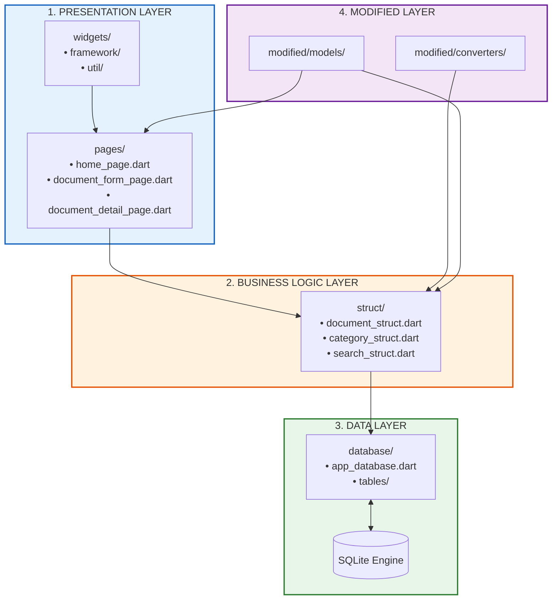
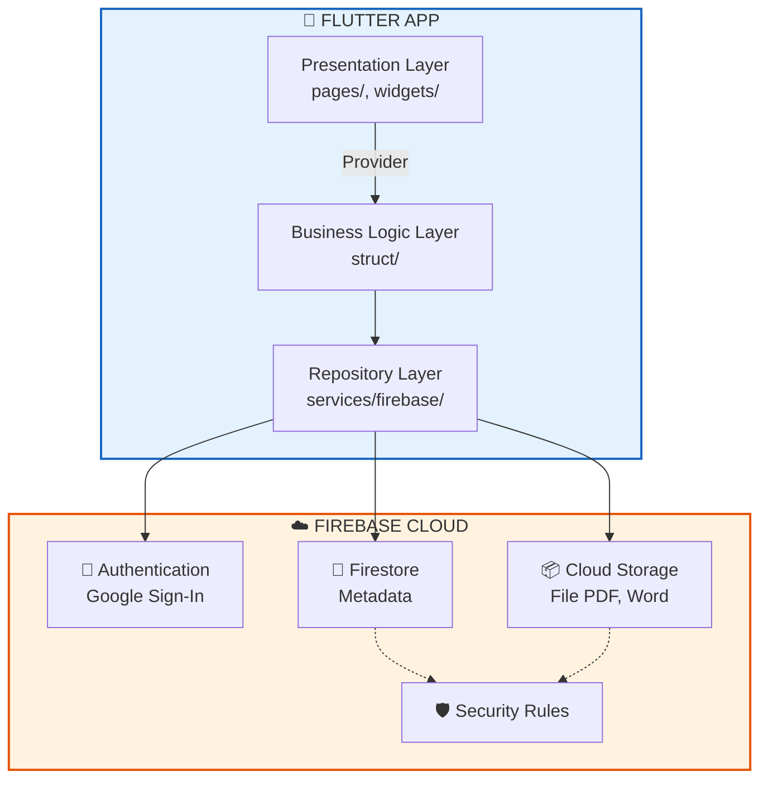
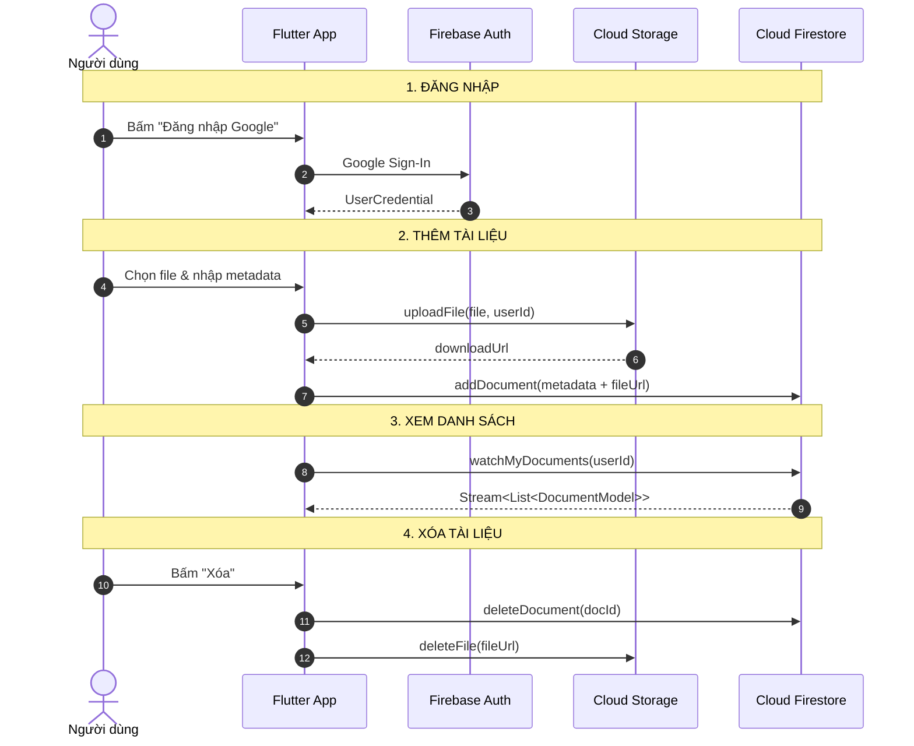

# 📚 StudyDocs Cloud - Tích hợp điện toán đám mây cho Hệ thống Quản lý Tài liệu

> Bài tập nhóm: Phân tích và tích hợp Cloud (Firebase) vào ứng dụng Flutter quản lý tài liệu học tập **StudyDocs**.
>
> **Nhóm 4 thành viên**: Nguyễn Thế Trưởng (Leader), Hàn Hoàng Hà, Nguyễn Đăng Đại, Phương Văn Đức.

---

## 📖 Mục lục

1. [Giới thiệu](#1--giới-thiệu)
2. [Phân tích các thành phần cốt lõi](#2--phân-tích-các-thành-phần-cốt-lõi-của-hệ-thống-hiện-tại)
3. [Điểm nghẽn của hệ thống truyền thống](#3--điểm-nghẽn-của-hệ-thống-truyền-thống)
4. [Lựa chọn mô hình Cloud & dịch vụ](#4--lựa-chọn-mô-hình-cloud--dịch-vụ)
5. [So sánh mô hình truyền thống vs. Cloud](#5--so-sánh-mô-hình-truyền-thống-vs-cloud)
6. [Kiến trúc tích hợp Cloud & luồng dữ liệu](#6--kiến-trúc-tích-hợp-cloud--luồng-dữ-liệu)
7. [Hướng dẫn setup Firebase với Flutter](#7--hướng-dẫn-setup-firebase-với-flutter)
8. [Code mẫu tích hợp](#8--code-mẫu-tích-hợp)
9. [Đánh giá tác động: Bảo mật, Chi phí, Hiệu suất](#9--đánh-giá-tác-động-bảo-mật-chi-phí-hiệu-suất)
10. [Slide tìm hiểu Firebase](#10--slide-tìm-hiểu-firebase--cách-setup)
11. [Phân công công việc nhóm](#11--phân-công-công-việc-nhóm)
12. [Timeline & Hướng dẫn chạy](#12--timeline--hướng-dẫn-chạy)

---

## 1. 🎯 Giới thiệu

**StudyDocs** là ứng dụng Flutter quản lý tài liệu học tập, ban đầu được xây dựng theo **Kiến trúc Cashew phiên bản rút gọn** (Offline-first, Drift ORM + SQLite, Provider).

**Mục tiêu bài tập**: Phân tích hệ thống hiện tại và đề xuất phương án tích hợp **Firebase** nhằm:
- Tối ưu hóa lưu trữ (thay vì chỉ lưu cục bộ).
- Tăng cường bảo mật (xác thực người dùng).
- Cho phép truy cập từ xa và đồng bộ đa thiết bị.

---

## 2. 🏗️ Phân tích các thành phần cốt lõi

### 2.1. Sơ đồ kiến trúc hiện tại



### 2.2. Bảng phân tích thành phần

| Thành phần | Vị trí | Vai trò | Công nghệ |
|---|---|---|---|
| **Frontend (UI)** | `lib/pages/`, `lib/widgets/` | Hiển thị danh sách, form, tìm kiếm, lọc | Flutter, Provider |
| **Business Logic** | `lib/struct/` | CRUD, validation, tìm kiếm | Dart thuần |
| **Database** | `lib/database/` | Lưu metadata tài liệu | Drift, SQLite |
| **File Storage** | Bộ nhớ thiết bị | Lưu file PDF, Word... | File System |
| **Models & Converters** | `lib/modified/` | DTO thuần Dart | Dart thuần |
| **Testing** | `test/` | Unit test với in-memory DB | Flutter Test |

> **Điểm mấu chốt**: Hệ thống hiện tại **chưa có Backend**, **chưa có xác thực**, dữ liệu hoàn toàn **cục bộ**.

---

## 3. ⚠️ Điểm nghẽn của hệ thống truyền thống

| # | Hạn chế | Hệ quả |
|---|---|---|
| 1 | Không truy cập từ xa | Không thể xem từ máy khác |
| 2 | Không đồng bộ đa thiết bị | Nhiều người không cùng quản lý được |
| 3 | Rủi ro mất dữ liệu | Mất thiết bị = mất toàn bộ |
| 4 | Không có xác thực | Ai mở app đều thấy hết |
| 5 | Khó chia sẻ | Không chia sẻ được giữa thành viên |
| 6 | Giới hạn dung lượng | Bộ nhớ thiết bị hữu hạn |
| 7 | Không có versioning | Không theo dõi lịch sử thay đổi |

---

## 4. ☁️ Lựa chọn mô hình Cloud & dịch vụ

### 4.1. So sánh các mô hình triển khai

| Tiêu chí | Public Cloud | Private Cloud | Hybrid Cloud |
|---|---|---|---|
| Chi phí ban đầu | Thấp | Cao | Trung bình |
| Độ phức tạp setup | Thấp | Cao | Trung bình |
| Khả năng mở rộng | Rất cao | Hạn chế | Cao |
| Bảo mật | Nhà cung cấp quản lý | Tự quản lý | Kết hợp |
| Phù hợp bài tập | ✅ Rất phù hợp | ❌ Quá phức tạp | ⚠️ Không cần |

### 4.2. Quyết định: **Public Cloud với Firebase (Google Cloud Platform)**

**Lý do lựa chọn:**
- Miễn phí ở mức cơ bản (Spark Plan).
- Tích hợp sẵn Authentication, Firestore, Cloud Storage.
- Hỗ trợ Flutter chính thức qua FlutterFire CLI.
- Offline persistence tích hợp sẵn.
- Tài liệu phong phú, cộng đồng lớn.

### 4.3. Các dịch vụ Firebase sẽ sử dụng

| Dịch vụ | Thay thế/bổ sung | Mục đích |
|---|---|---|
| **Firebase Authentication** | Chưa có | Đăng nhập Google |
| **Cloud Firestore** | SQLite (Drift) | Lưu metadata, offline + real-time sync |
| **Cloud Storage** | File cục bộ | Lưu file PDF, Word... |
| **Security Rules** | Chưa có | Kiểm soát truy cập |

---

## 5. 🔄 So sánh mô hình truyền thống vs. Cloud

| Tiêu chí | Truyền thống | Sau tích hợp Firebase |
|---|---|---|
| Lưu metadata | SQLite cục bộ | Firestore (cloud + cache) |
| Lưu file | Bộ nhớ thiết bị | Cloud Storage |
| Xác thực | ❌ Không | ✅ Firebase Auth |
| Truy cập từ xa | ❌ Không | ✅ Có |
| Đồng bộ đa thiết bị | ❌ Không | ✅ Real-time sync |
| Backup | ❌ Không | ✅ Tự động |
| Chia sẻ | ❌ Không | ✅ Qua Firestore rules |
| Chi phí | 0đ (rủi ro) | 0đ với Spark Plan |
| Bảo mật | ❌ Không | ✅ Security Rules + Auth |

---

## 6. 🏛️ Kiến trúc tích hợp Cloud & luồng dữ liệu

### 6.1. Sơ đồ kiến trúc tích hợp



### 6.2. Sơ đồ ASCII

```text
+-------------------------------------------------------------------------+
|                          📱 FLUTTER APP                                 |
|  PRESENTATION (pages/, widgets/)                                        |
|       |                                                                 |
|       v                                                                 |
|  BUSINESS LOGIC (struct/)                                               |
|       |                                                                 |
|       v                                                                 |
|  REPOSITORY (services/firebase/)                                        |
+------------------------------------+------------------------------------+
                                     | HTTPS / SDK
                                     v
+-------------------------------------------------------------------------+
|                          ☁️ FIREBASE CLOUD                              |
|  +----------------+  +----------------+  +----------------+              |
|  | Authentication |  |   Firestore    |  | Cloud Storage  |              |
|  | Google Sign-In |  |  (Metadata)    |  |  (File PDF)    |              |
|  +----------------+  +----------------+  +----------------+              |
|         ^                    ^                    ^                     |
|         +--------------------+--------------------+                     |
|                              |                                          |
|                    +------------------+                                 |
|                    | Security Rules   |                                 |
|                    +------------------+                                 |
+-------------------------------------------------------------------------+
```

### 6.3. Luồng dữ liệu



### 6.4. Luồng dữ liệu theo chức năng

| Chức năng | Luồng |
|---|---|
| **Đăng nhập** | User → Google Sign-In → Firebase Auth → userId |
| **Thêm** | Chọn file → Upload Storage → downloadUrl → Firestore metadata |
| **Xem DS** | Query Firestore theo ownerId → Stream → StreamBuilder |
| **Tìm kiếm** | Query Firestore where title/type/subject |
| **Sửa** | Update Firestore → Stream tự động phát |
| **Xóa** | Delete Firestore + xóa file Storage |

---

## 7. 🔥 Hướng dẫn setup Firebase với Flutter

> Tham khảo: [Firebase Flutter Setup (Tiếng Việt)](https://firebase.google.com/docs/flutter/setup?hl=vi)

### Bước 1: Cài đặt công cụ

```bash
npm install -g firebase-tools
firebase login
dart pub global activate flutterfire_cli
```

### Bước 2: Tạo Firebase Project

1. Truy cập [console.firebase.google.com](https://console.firebase.google.com/)
2. **Add project** → đặt tên (ví dụ: `studydocs-cloud`)
3. Bật Google Analytics (tùy chọn) → **Create project**

### Bước 3: Cấu hình Flutter app

```bash
flutterfire configure
```

Lệnh này tạo file `lib/firebase_options.dart` và thêm các plugin cần thiết.

### Bước 4: Khởi tạo Firebase trong `main.dart`

```dart
import 'package:firebase_core/firebase_core.dart';
import 'firebase_options.dart';

void main() async {
  WidgetsFlutterBinding.ensureInitialized();
  await Firebase.initializeApp(
    options: DefaultFirebaseOptions.currentPlatform,
  );
  runApp(const MyApp());
}
```

### Bước 5: Thêm các plugin

```bash
flutter pub add firebase_core
flutter pub add firebase_auth
flutter pub add cloud_firestore
flutter pub add firebase_storage
flutter pub add google_sign_in
```

### Bước 6: Bật Google Sign-In

1. Vào **Authentication → Sign-in method → Google** → Enable.
2. Với Android, lấy SHA-1 fingerprint:

```bash
cd android
./gradlew signingReport
```

3. Dán SHA-1 vào Firebase Console → Project Settings → Android app.

### Bước 7: Cấu hình Security Rules

**Firestore Rules** (`firestore.rules`):

```javascript
rules_version = '2';
service cloud.firestore {
  match /databases/{database}/documents {
    match /documents/{docId} {
      allow read, write: if request.auth != null
        && request.auth.uid == resource.data.ownerId;
      allow create: if request.auth != null
        && request.auth.uid == request.resource.data.ownerId;
    }
  }
}
```

**Storage Rules** (`storage.rules`):

```javascript
rules_version = '2';
service firebase.storage {
  match /b/{bucket}/o {
    match /documents/{userId}/{allPaths=**} {
      allow read, write: if request.auth != null
        && request.auth.uid == userId;
    }
  }
}
```

### Bước 8: Mời thành viên nhóm

1. Vào **Project Settings → Users and permissions**.
2. **Add member** → nhập email → quyền **Editor**.

---

## 8. 💻 Code mẫu tích hợp

### 8.1. Đăng nhập Google

```dart
import 'package:firebase_auth/firebase_auth.dart';
import 'package:google_sign_in/google_sign_in.dart';

class AuthService {
  final FirebaseAuth _auth = FirebaseAuth.instance;
  final GoogleSignIn _googleSignIn = GoogleSignIn();

  User? get currentUser => _auth.currentUser;
  Stream<User?> get authStateChanges => _auth.authStateChanges();

  Future<UserCredential> signInWithGoogle() async {
    final googleUser = await _googleSignIn.signIn();
    if (googleUser == null) throw Exception('Đăng nhập bị hủy');

    final googleAuth = await googleUser.authentication;
    final credential = GoogleAuthProvider.credential(
      accessToken: googleAuth.accessToken,
      idToken: googleAuth.idToken,
    );
    return await _auth.signInWithCredential(credential);
  }

  Future<void> signOut() async {
    await _googleSignIn.signOut();
    await _auth.signOut();
  }
}
```

### 8.2. Upload file lên Cloud Storage

```dart
import 'dart:io';
import 'package:firebase_storage/firebase_storage.dart';

class StorageService {
  final FirebaseStorage _storage = FirebaseStorage.instance;

  Future<String> uploadFile(File file, String userId) async {
    final fileName = '${DateTime.now().millisecondsSinceEpoch}_${file.path.split('/').last}';
    final ref = _storage.ref().child('documents/$userId/$fileName');

    final uploadTask = ref.putFile(file);
    await uploadTask;
    return await ref.getDownloadURL();
  }

  Future<void> deleteFile(String downloadUrl) async {
    final ref = _storage.refFromURL(downloadUrl);
    await ref.delete();
  }
}
```

### 8.3. Lưu metadata lên Firestore

```dart
import 'package:cloud_firestore/cloud_firestore.dart';
import 'package:firebase_auth/firebase_auth.dart';

class DocumentService {
  final FirebaseFirestore _db = FirebaseFirestore.instance;
  final FirebaseAuth _auth = FirebaseAuth.instance;

  String get _uid => _auth.currentUser!.uid;

  Future<void> addDocument({
    required String title,
    required String type,
    required String subject,
    required String fileUrl,
    String? description,
  }) async {
    await _db.collection('documents').add({
      'title': title,
      'type': type,
      'subject': subject,
      'description': description ?? '',
      'fileUrl': fileUrl,
      'ownerId': _uid,
      'createdAt': FieldValue.serverTimestamp(),
      'updatedAt': FieldValue.serverTimestamp(),
    });
  }

  Future<void> updateDocument(String docId, Map<String, dynamic> data) async {
    await _db.collection('documents').doc(docId).update({
      ...data,
      'updatedAt': FieldValue.serverTimestamp(),
    });
  }

  Future<void> deleteDocument(String docId, String fileUrl) async {
    await _db.collection('documents').doc(docId).delete();
    await StorageService().deleteFile(fileUrl);
  }
}
```

### 8.4. Lắng nghe danh sách real-time

```dart
Stream<List<Map<String, dynamic>>> watchMyDocuments() {
  return FirebaseFirestore.instance
      .collection('documents')
      .where('ownerId', isEqualTo: _uid)
      .orderBy('updatedAt', descending: true)
      .snapshots()
      .map((snapshot) => snapshot.docs
          .map((doc) => {'id': doc.id, ...doc.data()})
          .toList());
}
```

### 8.5. Sử dụng trong UI

```dart
StreamBuilder<List<Map<String, dynamic>>>(
  stream: DocumentService().watchMyDocuments(),
  builder: (context, snapshot) {
    if (snapshot.connectionState == ConnectionState.waiting) {
      return const LoadingIndicator(message: 'Đang tải...');
    }
    if (!snapshot.hasData || snapshot.data!.isEmpty) {
      return const EmptyState(message: 'Chưa có tài liệu nào');
    }
    final docs = snapshot.data!;
    return ListView.builder(
      itemCount: docs.length,
      itemBuilder: (context, index) => DocumentTile(data: docs[index]),
    );
  },
)
```

---

## 9. 📊 Đánh giá tác động: Bảo mật, Chi phí, Hiệu suất

### 9.1. Bảo mật

| Khía cạnh | Trước | Sau |
|---|---|---|
| Xác thực | Không | Firebase Auth (Google) |
| Phân quyền | Không | Security Rules theo ownerId |
| Truyền tải | Không | HTTPS/TLS |
| Lưu trữ | File cục bộ | Cloud Storage + rules |

**Biện pháp bổ sung:**
- Bật **App Check** chống lạm dụng API.
- Không lưu API key trực tiếp.
- Giới hạn kích thước file (ví dụ 20MB).

### 9.2. Chi phí

| Dịch vụ | Spark Plan (Miễn phí) | Đủ cho bài tập? |
|---|---|---|
| Firestore | 1GB storage, 50k reads/ngày, 20k writes/ngày | ✅ Đủ |
| Cloud Storage | 5GB storage, 1GB download/ngày | ✅ Đủ |
| Authentication | Không giới hạn | ✅ Đủ |

> Spark Plan hoàn toàn đủ cho bài tập nhóm 4 thành viên.

### 9.3. Hiệu suất

| Khía cạnh | Đánh giá |
|---|---|
| Real-time sync | Firestore snapshots() tự động cập nhật |
| Offline-first | Firestore cache hoạt động khi mạng yếu |
| Upload file lớn | putFile() với progress listener |
| Tìm kiếm | Chỉ prefix search (hạn chế full-text) |
| Độ trễ | Chọn region asia-southeast1 (Singapore) |

---

## 10. 🎞️ Slide tìm hiểu Firebase & cách setup

### 10.1. Cấu trúc slide (12 slides)

| Slide | Nội dung | Người phụ trách |
|---|---|---|
| 1 | Trang bìa | Trưởng |
| 2 | Firebase là gì? | Hà |
| 3 | Kiến trúc hiện tại của app | Trưởng |
| 4 | Điểm nghẽn của hệ thống | Trưởng |
| 5 | Giải pháp: Tích hợp Firebase | Trưởng |
| 6 | Firebase Authentication | Hà |
| 7 | Cloud Storage | Đại |
| 8 | Cloud Firestore | Đại |
| 9 | So sánh trước/sau | Đức |
| 10 | Bảo mật, chi phí, hiệu suất | Đức |
| 11 | Demo / Code mẫu | Cả nhóm |
| 12 | Kết luận & Hướng phát triển | Trưởng |

### 10.2. Nội dung chi tiết

#### Slide 2: Firebase là gì?
- Nền tảng Backend-as-a-Service (BaaS) của Google.
- Cung cấp: Auth, Firestore, Storage, Hosting, Functions, Analytics.
- **Ưu điểm**: Miễn phí cơ bản, tích hợp Flutter tốt.
- **Nhược điểm**: Phụ thuộc nhà cung cấp, chi phí tăng khi scale.

#### Slide 6: Firebase Authentication
- Hỗ trợ Google, Email/Password, Facebook, Apple...
- Quản lý session tự động qua `authStateChanges()`.
- Tích hợp dễ dàng qua `firebase_auth` + `google_sign_in`.

#### Slide 7: Cloud Storage
- Lưu file (PDF, Word, Image...) trên cloud.
- Trả về `downloadUrl` truy cập file.
- Upload với progress listener.
- Security Rules theo user.

#### Slide 8: Cloud Firestore
- NoSQL document DB, real-time sync.
- Offline persistence.
- Query với `where`, `orderBy`, `limit`.
- **Hạn chế**: Không full-text search.

#### Slide 10: Bảo mật, chi phí, hiệu suất
- **Bảo mật**: Security Rules + Auth + App Check.
- **Chi phí**: Spark Plan miễn phí.
- **Hiệu suất**: Real-time, offline-first, region Singapore.

### 10.3. Setup tài khoản Firebase cho nhóm

1. **Trưởng** tạo project → thêm thành viên vào **Users and permissions** (quyền Editor).
2. Cùng dùng chung project.
3. Trên Git: một người chạy `flutterfire configure` và commit `firebase_options.dart` + `google-services.json`.

### 10.4. Lưu ý khi bảo vệ

- Chuẩn bị **demo trực tiếp** nếu có thể.
- Câu hỏi thường gặp:
  - *Tại sao chọn Firebase?* → Miễn phí, tích hợp Flutter tốt.
  - *Bảo mật thế nào?* → Security Rules + Auth + App Check.
  - *Chi phí khi scale?* → Blaze Plan, tối ưu query.

---

## 11. 👥 Phân công công việc nhóm

### 11.1. Bảng phân công

| Thành viên | Vai trò | Nhiệm vụ | Sản phẩm |
|---|---|---|---|
| **Nguyễn Thế Trưởng** (Leader) | Tổng hợp & Kiến trúc | • Viết mục 1–3<br>• Vẽ sơ đồ kiến trúc<br>• Tổng hợp slide<br>• Thuyết trình chính | Mục 1–3, sơ đồ, slide 1/3/4/5/12 |
| **Hàn Hoàng Hà** | Firebase Auth & Setup | • Setup Firebase project<br>• Tích hợp Google Sign-In<br>• Viết mục 7 | Code Auth, mục 7, slide 2/6 |
| **Nguyễn Đăng Đại** | Cloud Storage & Firestore | • Upload file lên Storage<br>• CRUD metadata Firestore<br>• Viết mục 6 | Code Storage + Document, mục 6, slide 7/8 |
| **Phương Văn Đức** | Đánh giá & So sánh | • Bảng so sánh (mục 5)<br>• Đánh giá bảo mật/chi phí/hiệu suất (mục 9) | Mục 5, 9, slide 9/10 |

### 11.2. Sơ đồ phân công

```mermaid
graph TD
    subgraph Leader["👑 Nguyễn Thế Trưởng"]
        L1[Phân tích hệ thống]
        L2[Thiết kế kiến trúc]
        L3[Tổng hợp slide]
    end

    subgraph Ha["🔐 Hàn Hoàng Hà"]
        H1[Setup Firebase]
        H2[Google Sign-In]
        H3[Slide Auth]
    end

    subgraph Dai["📦 Nguyễn Đăng Đại"]
        D1[Cloud Storage]
        D2[Firestore CRUD]
        D3[Slide Storage/Firestore]
    end

    subgraph Duc["📊 Phương Văn Đức"]
        U1[So sánh mô hình]
        U2[Đánh giá tác động]
        U3[Slide đánh giá]
    end

    L1 --> L3
    L2 --> L3
    H1 --> H2 --> H3
    D1 --> D2 --> D3
    U1 --> U2 --> U3

    style Leader fill:#E3F2FD,stroke:#1565C0,stroke-width:2px;
    style Ha fill:#FFF3E0,stroke:#E65100,stroke-width:2px;
    style Dai fill:#E8F5E9,stroke:#2E7D32,stroke-width:2px;
    style Duc fill:#F3E5F5,stroke:#6A1B9A,stroke-width:2px;
```



---

## 12. 📅 Timeline & Hướng dẫn chạy

### 12.1. Timeline 2 tuần

| Tuần | Trưởng | Hà | Đại | Đức |
|---|---|---|---|---|
| **Tuần 1** | Viết mục 1–3, vẽ sơ đồ | Setup Firebase, code Auth | Code Storage + Firestore | Viết bảng so sánh |
| **Tuần 2** | Tổng hợp slide, review | Hoàn thiện slide Auth | Hoàn thiện slide Storage/Firestore | Hoàn thiện slide đánh giá |

### 12.2. Checklist

- [ ] **Trưởng**: Tạo Firebase project, mời thành viên.
- [ ] **Hà**: Chạy `flutterfire configure`, setup Google Sign-In.
- [ ] **Đại**: Viết hàm upload file + lưu Firestore.
- [ ] **Đức**: Viết bảng so sánh và đánh giá.
- [ ] **Cả nhóm**: Làm slide phần mình, Trưởng tổng hợp.
- [ ] **Cả nhóm**: Review chéo trước khi nộp.

### 12.3. Hướng dẫn cài đặt & chạy

```bash
# Bước 1: Cài dependencies
flutter pub get

# Bước 2: Sinh mã nguồn Drift (nếu còn dùng)
dart run build_runner build --delete-conflicting-outputs

# Bước 3: Cấu hình Firebase (chỉ chạy 1 lần)
flutterfire configure

# Bước 4: Chạy app
flutter run -d chrome    # Web
flutter run              # Windows / Emulator

# Bước 5: Chạy test
flutter test test/document_struct_test.dart
```

### 12.4. Lưu ý khi nộp bài

- **README.md** là sản phẩm chính.
- **Slide** (PDF/PPTX) là sản phẩm trình bày.
- **Code** (nếu có) là minh họa — không bắt buộc 100%.
- **Demo** (nếu có) giúp tăng điểm.

---

## 📌 Tóm tắt việc cần làm ngay

1. **Trưởng**: Tạo Firebase project, mời thành viên.
2. **Hà**: Chạy `flutterfire configure`, setup Google Sign-In.
3. **Đại**: Viết hàm upload file + lưu Firestore.
4. **Đức**: Viết bảng so sánh và đánh giá.
5. **Cả nhóm**: Mỗi người làm slide phần mình, Trưởng tổng hợp.

> ✅ **Nguyên tắc**: Không cần code hoàn chỉnh 100% — chỉ cần **phân tích đúng** và **phương án khả thi**. Slide là phần quan trọng nhất.

---

## 📚 Tài liệu tham khảo

- [Firebase Flutter Setup (Tiếng Việt)](https://firebase.google.com/docs/flutter/setup?hl=vi)
- [Firebase Authentication](https://firebase.google.com/docs/auth)
- [Cloud Firestore](https://firebase.google.com/docs/firestore)
- [Cloud Storage for Firebase](https://firebase.google.com/docs/storage)
- [FlutterFire Documentation](https://firebase.flutter.dev/)
- [Firebase Security Rules](https://firebase.google.com/docs/rules)