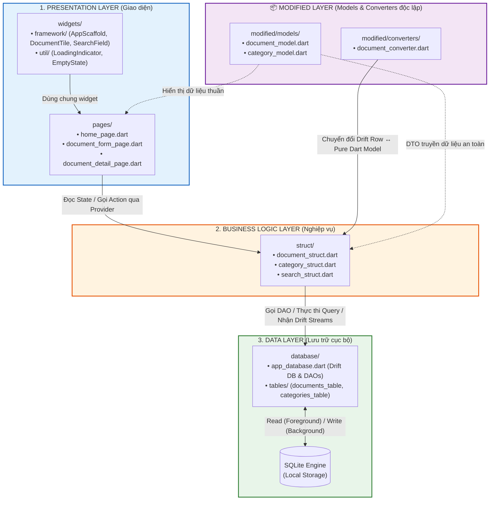
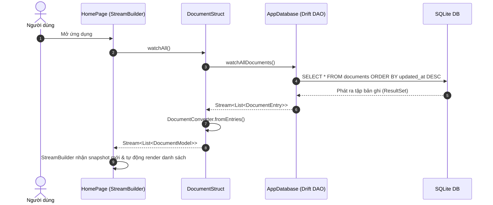
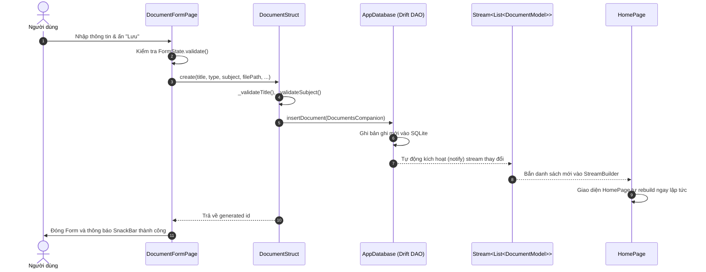
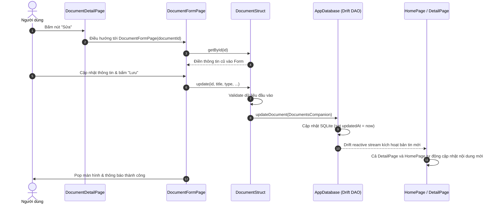
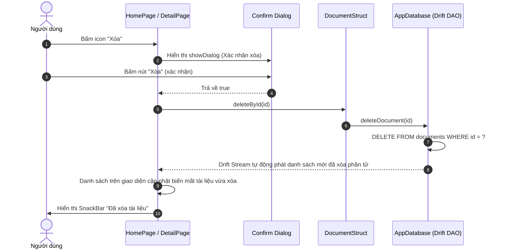
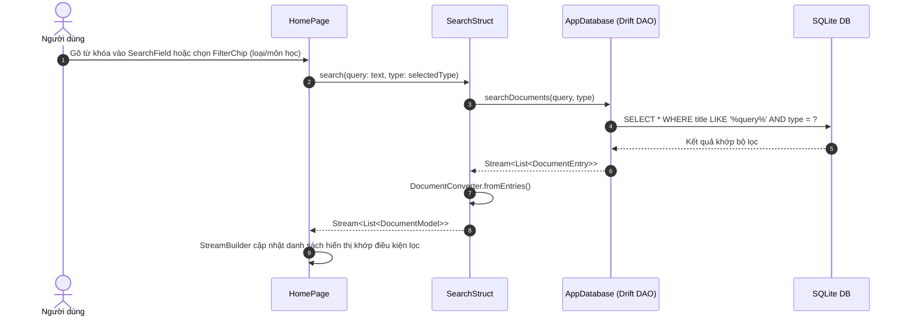

# 📚 StudyDocs - Quản lý tài liệu học tập

> Ứng dụng Flutter quản lý tài liệu học tập áp dụng **Kiến trúc Cashew phiên bản Rút gọn** (Offline-first, Reactive Streams với Drift ORM & SQLite, State Management qua Provider).

---

## 1. 🏗️ Sơ đồ kiến trúc 4 tầng rút gọn

### 📊 Sơ đồ Mermaid



### 📋 Sơ đồ ASCII

```text
+-------------------------------------------------------------------------+
|                      1. PRESENTATION LAYER (UI)                         |
|   pages/ (home_page, document_form_page, document_detail_page)          |
|   widgets/ (AppScaffold, DocumentTile, SearchField, EmptyState, ...)     |
|   • Chỉ nhận dữ liệu Model qua StreamBuilder                            |
|   • Gửi action qua context.read<DocumentStruct>()                       |
+------------------------------------+------------------------------------+
                                     | (Provider / pure Models)
                                     v
+-------------------------------------------------------------------------+
|                  2. BUSINESS LOGIC LAYER (struct/)                      |
|   document_struct.dart, category_struct.dart, search_struct.dart        |
|   • Chứa toàn bộ use-cases, logic validation, sắp xếp                   |
|   • Không phụ thuộc Flutter widgets (khả năng Unit Test cao)            |
|   • Expose Stream<List<DocumentModel>> & Future<...>                    |
+-------------------+----------------+------------------------------------+
                    |                ^
     (Giao tiếp DAO)|                | (Mapper Drift Row -> Model)
                    v                |
+-------------------+----------------+---+  +-----------------------------+
|          3. DATA LAYER (database/)     |  |     4. MODIFIED LAYER       |
|   app_database.dart, tables/           |  |   modified/models/          |
|   • Drift ORM Schema & DAOs            |  |   modified/converters/      |
|   • SQLite Native File Execution       |  |   • Pure Dart DTOs          |
|   • watch() reactive streams tự kích   |  |   • Độc lập với mọi tầng    |
|     hoạt khi có thay đổi dữ liệu       |  +-----------------------------+
+----------------------------------------+
```

---

## 2. 🔄 Sơ đồ luồng dữ liệu 4 chức năng CRUD + Search

### 2.1. Luồng READ (Hiển thị danh sách Reactive)



### 2.2. Luồng CREATE (Thêm mới tài liệu)



### 2.3. Luồng UPDATE (Sửa tài liệu)



### 2.4. Luồng DELETE (Xóa tài liệu có Confirm Dialog)



### 2.5. Luồng SEARCH & FILTER (Tìm kiếm & Lọc)



---

## 3. 📂 Bảng giải thích trách nhiệm từng thư mục

| Thư mục / Tệp              | Tầng kiến trúc                | Trách nhiệm chi tiết                                                                                                                                                                                                                                                                                                                                                          |
| -------------------------- | ----------------------------- | ----------------------------------------------------------------------------------------------------------------------------------------------------------------------------------------------------------------------------------------------------------------------------------------------------------------------------------------------------------------------------- |
| `lib/main.dart`            | Root / App Entry              | • Điểm khởi chạy của ứng dụng.<br>• Khởi tạo singleton `AppDatabase`.<br>• Cấu hình `MultiProvider` để cung cấp các struct instances cho toàn app.<br>• Định nghĩa Theme (Material 3, Dark/Light mode).                                                                                                                                                                       |
| `lib/database/`            | Data Layer                    | • Quản lý SQLite database thông qua Drift ORM.<br>• Mở kết nối đa nền tảng (`drift_flutter`).<br>• Quản trị migration strategy & seed data ban đầu.<br>• Cung cấp các DAO methods (query, insert, update, delete, watch).                                                                                                                                                     |
| `lib/database/tables/`     | Data Layer (Schema)           | • `documents_table.dart`: Định nghĩa cấu trúc bảng documents (id, title, description, type, subject, filePath, categoryId, dates).<br>• `categories_table.dart`: Định nghĩa bảng danh mục môn học.                                                                                                                                                                            |
| `lib/modified/models/`     | Domain / DTO                  | • Chứa các class Pure Dart Model (`DocumentModel`, `CategoryModel`, `enum DocumentType`).<br>• Hoàn toàn không phụ thuộc Drift, Flutter hay bất kỳ thư viện bên ngoài nào.<br>• Sử dụng làm đối tượng chuẩn trao đổi giữa Presentation và Business Logic.                                                                                                                     |
| `lib/modified/converters/` | Mapper / Converter            | • `document_converter.dart`: Chuyển đổi qua lại giữa Drift generated classes (`DocumentEntry`, `CategoryEntry`) và Domain Models (`DocumentModel`, `CategoryModel`). Giữ cho Business Logic tách biệt với ORM.                                                                                                                                                                |
| `lib/struct/`              | Business Logic Layer          | • Nơi chứa toàn bộ nghiệp vụ (Use-Cases):<br>&nbsp;&nbsp;- `document_struct.dart`: CRUD, validation tiêu đề, môn học, đếm theo loại.<br>&nbsp;&nbsp;- `category_struct.dart`: Quản lý danh mục/môn học.<br>&nbsp;&nbsp;- `search_struct.dart`: Nghiệp vụ tìm kiếm tiêu đề & lọc đa tiêu chí.<br>• **Quy tắc**: Không import Flutter Widgets, chỉ trả về `Future` và `Stream`. |
| `lib/pages/`               | Presentation (Screens)        | • Màn hình giao diện hoàn chỉnh:<br>&nbsp;&nbsp;- `home_page.dart`: Danh sách tài liệu, thanh tìm kiếm, filter chips, thống kê số lượng tài liệu theo loại.<br>&nbsp;&nbsp;- `document_form_page.dart`: Form thêm mới & chỉnh sửa tài liệu với validation.<br>&nbsp;&nbsp;- `document_detail_page.dart`: Xem chi tiết, điều hướng sửa hoặc mở dialog xác nhận xóa.            |
| `lib/widgets/framework/`   | Presentation (Custom Widgets) | • Các widget cấp cao có thể tái sử dụng:<br>&nbsp;&nbsp;- `app_scaffold.dart`: Khung Scaffold chuẩn đồng nhất cho các màn hình.<br>&nbsp;&nbsp;- `document_tile.dart`: Thẻ hiển thị một tài liệu kèm icon, màu sắc theo loại, môn học, ngày tạo.<br>&nbsp;&nbsp;- `search_field.dart`: Thanh tìm kiếm với nút xóa nhanh từ khóa.                                              |
| `lib/widgets/util/`        | Presentation (Helper Widgets) | • Các widget trạng thái tiện ích:<br>&nbsp;&nbsp;- `loading_indicator.dart`: Vòng xoay tiến trình kèm thông điệp.<br>&nbsp;&nbsp;- `empty_state.dart`: Trạng thái rỗng khi chưa có dữ liệu hoặc không tìm thấy kết quả.                                                                                                                                                       |
| `test/`                    | Testing Layer                 | • Kiểm thử đơn vị (Unit Tests):<br>&nbsp;&nbsp;- `document_struct_test.dart`: Kiểm thử toàn diện CRUD, validation logic, và phản ứng stream với in-memory database (`NativeDatabase.memory()`).                                                                                                                                                                               |

---

## 4. 🚀 Hướng dẫn cài đặt & Khởi chạy

### Bước 1: Cài đặt dependencies

```bash
flutter pub get
```

### Bước 2: Sinh mã nguồn Drift (Build Runner)

```bash
dart run build_runner build --delete-conflicting-outputs
```

### Bước 3: Chạy ứng dụng

- Chạy trên thiết bị mặc định (Windows desktop / Emulator):

```bash
flutter run
```

- Chạy trên Google Chrome (Web):

```bash
flutter run -d chrome
```

> **Ghi chú cho nền tảng Web**: Drift chạy SQLite trên trình duyệt qua WebAssembly, yêu cầu 2 tệp `sqlite3.wasm` và `drift_worker.js` đặt trong thư mục `web/` (đã được cấu hình sẵn trong dự án).

### Bước 4: Chạy Unit Test kiểm tra nghiệp vụ

```bash
flutter test test/document_struct_test.dart
```

---

## 5. 🛡️ Quy tắc phân tách tầng bắt buộc (Cashew Rules)

1. **Giao diện (`pages/`, `widgets/`)**:
    - Chỉ được giao tiếp với tầng `struct/` qua Provider (`context.read<DocumentStruct>()`).
    - Tuyệt đối không import hoặc gọi trực tiếp `AppDatabase` hay DAO.
    - Luôn sử dụng `StreamBuilder` để lắng nghe thay đổi tự động từ `Stream` do `struct` cung cấp.
2. **Nghiệp vụ (`struct/`)**:
    - Chỉ giao tiếp với `database/` và `modified/`.
    - Tuyệt đối không import `package:flutter/material.dart` hoặc các Flutter widgets.
3. **Cơ sở dữ liệu (`database/`)**:
    - Quản lý Drift ORM và SQLite queries.
    - Tuyệt đối không phụ thuộc ngược lên tầng `struct/`.
4. **Mô hình (`modified/`)**:
    - Thuần Dart (POJO/DTO), không phụ thuộc bất kỳ tầng nào.
