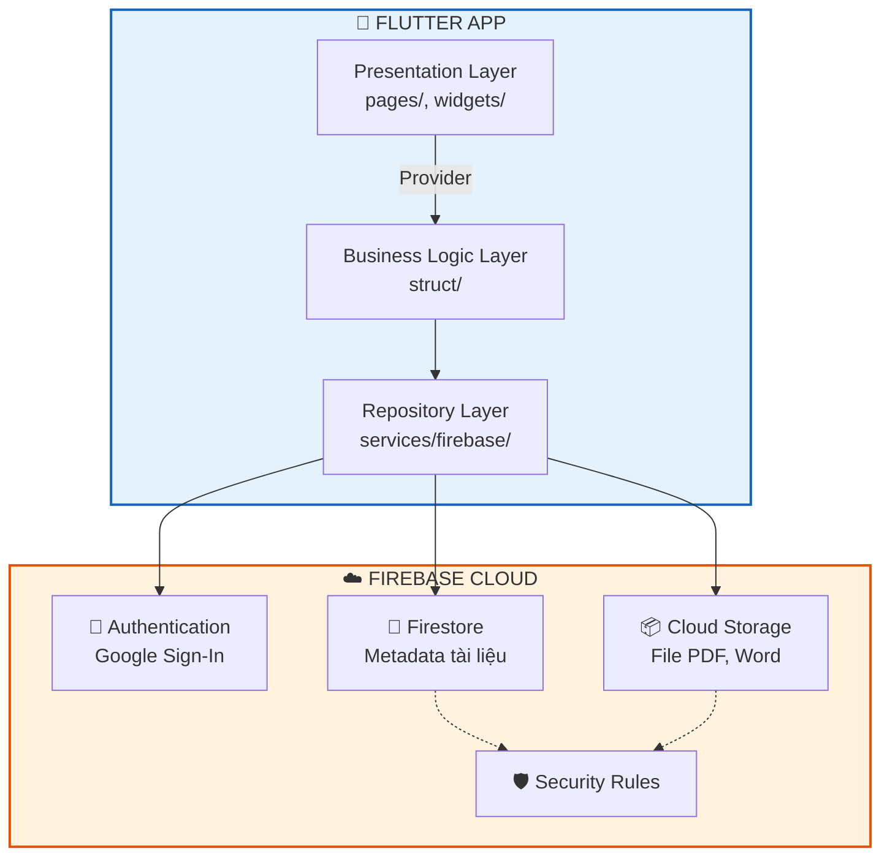
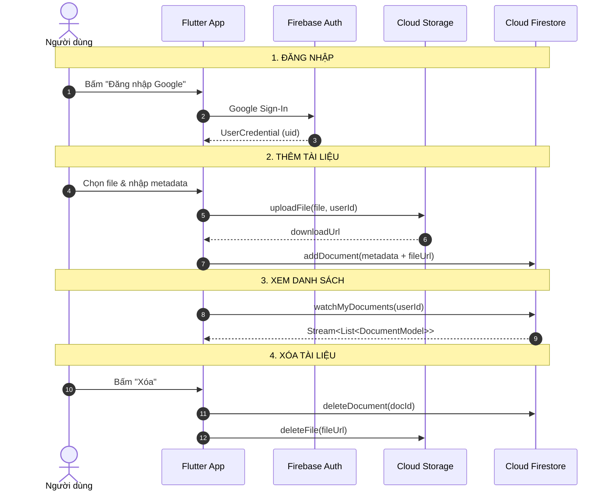

# 🔥 Firebase Setup Guide - StudyDocs Cloud

> Tài liệu hướng dẫn tích hợp Firebase vào ứng dụng **StudyDocs**.
> Đây là nguồn tài liệu chính để tạo slide thuyết trình và để các thành viên trong nhóm tự setup.

---

## 📖 Mục lục

1. [Firebase là gì?](#1--firebase-là-gì)
2. [Tại sao chọn Firebase cho StudyDocs?](#2--tại-sao-chọn-firebase-cho-studydocs)
3. [Các dịch vụ Firebase sẽ dùng](#3--các-dịch-vụ-firebase-sẽ-dùng)
4. [Kiến trúc tích hợp Firebase](#4--kiến-trúc-tích-hợp-firebase)
5. [Hướng dẫn setup từng bước](#5--hướng-dẫn-setup-từng-bước)
6. [Quản lý file cấu hình với Git](#6--quản-lý-file-cấu-hình-với-git)
7. [Câu hỏi thường gặp (FAQ)](#7--câu-hỏi-thường-gặp-faq)
8. [Tài liệu tham khảo](#8--tài-liệu-tham-khảo)

---

## 1. 🔥 Firebase là gì?

**Firebase** là nền tảng **Backend-as-a-Service (BaaS)** do Google phát triển, cung cấp hạ tầng backend sẵn sàng cho ứng dụng di động và web mà không cần tự xây dựng server.

### 1.1. Lịch sử

- **2011**: Firebase được thành lập bởi Andrew Lee và James Tamplin.
- **2014**: Google mua lại Firebase.
- **2016**: Ra mắt Firebase Cloud Messaging, Firebase Authentication.
- **Hiện nay**: Là một trong những nền tảng BaaS phổ biến nhất thế giới.

### 1.2. Các nhóm dịch vụ chính

| Nhóm | Dịch vụ tiêu biểu | Mục đích |
|---|---|---|
| **Build** | Authentication, Firestore, Realtime Database, Cloud Storage, Hosting, Cloud Functions | Xây dựng backend, xác thực, lưu trữ |
| **Release & Monitor** | Crashlytics, Analytics, Performance Monitoring, App Distribution | Theo dõi lỗi, phân tích, phân phối |
| **Engage** | Cloud Messaging, In-App Messaging, Dynamic Links, Remote Config | Tương tác người dùng, cấu hình từ xa |

### 1.3. Ưu điểm & nhược điểm

**Ưu điểm:**
- Miễn phí ở mức cơ bản (Spark Plan).
- Tích hợp sẵn, không cần tự code backend.
- Hỗ trợ Flutter chính thức qua FlutterFire.
- Offline persistence cho Firestore.
- Real-time sync tự động.

**Nhược điểm:**
- Phụ thuộc vào nhà cung cấp (vendor lock-in).
- Chi phí tăng nhanh khi scale lớn.
- Hạn chế full-text search (phải dùng Algolia hoặc tương tự).
- Khó migration sang nhà cung cấp khác.

> **Dùng cho slide:** Slide 2 — "Firebase là gì?"

---

## 2. 🎯 Tại sao chọn Firebase cho StudyDocs?

### 2.1. Bảng so sánh các giải pháp

| Tiêu chí | Firebase | AWS Amplify | Azure Mobile Apps | Tự build Backend |
|---|---|---|---|---|
| Chi phí ban đầu | ✅ Miễn phí (Spark) | ⚠️ Miễn phí hạn chế | ⚠️ Miễn phí hạn chế | ❌ Cao (server, DevOps) |
| Độ phức tạp setup | ✅ Thấp | ⚠️ Trung bình | ⚠️ Trung bình | ❌ Rất cao |
| Hỗ trợ Flutter | ✅ Chính thức | ✅ Tốt | ⚠️ Trung bình | ⚠️ Tùy |
| Offline-first | ✅ Có sẵn | ⚠️ Cần cấu hình | ⚠️ Cần cấu hình | ❌ Tự làm |
| Real-time sync | ✅ Có sẵn | ✅ Có | ✅ Có | ❌ Tự làm |
| Tài liệu | ✅ Phong phú | ✅ Tốt | ⚠️ Ít hơn | — |
| Phù hợp bài tập | ✅ Rất phù hợp | ⚠️ Được | ⚠️ Được | ❌ Quá phức tạp |

### 2.2. Kết luận

Firebase là lựa chọn **tối ưu** cho bài tập nhóm vì:
1. Miễn phí với Spark Plan.
2. Tích hợp Flutter chính thức, setup nhanh.
3. Có sẵn Auth, Firestore, Storage — đúng nhu cầu của StudyDocs.
4. Hỗ trợ offline-first — phù hợp với kiến trúc hiện tại.
5. Tài liệu tiếng Việt phong phú, dễ học.

> **Dùng cho slide:** Slide 5 — "Giải pháp: Tích hợp Firebase"

---

## 3. 📦 Các dịch vụ Firebase sẽ dùng

### 3.1. Tổng quan

| Dịch vụ | Vai trò | Thay thế cho |
|---|---|---|
| **Firebase Authentication** | Đăng nhập Google, quản lý session | Chưa có (thêm mới) |
| **Cloud Firestore** | Lưu metadata tài liệu, real-time sync | Drift + SQLite |
| **Cloud Storage** | Lưu file PDF, Word, Slide | File system cục bộ |
| **Security Rules** | Kiểm soát truy cập theo user | Chưa có (thêm mới) |

### 3.2. Firebase Authentication

**Cách hoạt động:**
- Người dùng đăng nhập qua Google, Facebook, Email/Password...
- Firebase trả về `UserCredential` chứa `uid` (ID người dùng).
- Session được quản lý tự động, có stream `authStateChanges()`.

**Gói miễn phí (Spark Plan):**
- Không giới hạn số lượng người dùng.
- Không giới hạn số lần đăng nhập.

**Lợi ích cho StudyDocs:**
- Xác thực người dùng — bảo vệ tài liệu cá nhân.
- Dùng `uid` làm khóa để phân tách dữ liệu giữa các user.

### 3.3. Cloud Firestore

**Cách hoạt động:**
- NoSQL document database, lưu dữ liệu dạng collection/document.
- Hỗ trợ real-time sync qua `snapshots()`.
- Có offline persistence mặc định trên Android/iOS.
- Query linh hoạt với `where`, `orderBy`, `limit`.

**Gói miễn phí (Spark Plan):**
- 1GB storage.
- 50.000 reads/ngày.
- 20.000 writes/ngày.
- 20.000 deletes/ngày.

**Lợi ích cho StudyDocs:**
- Thay thế SQLite cục bộ, dữ liệu lưu trên cloud.
- Tự động đồng bộ giữa các thiết bị.
- Offline-first: đọc/ghi khi mất mạng, tự sync khi có mạng.

**Hạn chế:**
- Không hỗ trợ full-text search (chỉ prefix search).
- Query phức tạp cần index — có thể tốn chi phí.

### 3.4. Cloud Storage

**Cách hoạt động:**
- Lưu trữ file (PDF, Word, Image, Video...) trên cloud.
- Trả về `downloadUrl` để truy cập file.
- Hỗ trợ upload với progress listener.

**Gói miễn phí (Spark Plan):**
- 5GB storage.
- 1GB download/ngày.
- 20.000 uploads/ngày.

**Lợi ích cho StudyDocs:**
- Lưu file tập trung, không phụ thuộc thiết bị.
- Truy cập từ mọi nơi qua `downloadUrl`.
- Security Rules giới hạn quyền truy cập.

### 3.5. Security Rules

**Cách hoạt động:**
- Ngôn ngữ rule riêng của Firebase, chạy trên server.
- Kiểm tra quyền truy cập trước khi cho phép đọc/ghi.
- Có thể dựa vào `request.auth`, `resource.data`, `request.resource.data`.

**Lợi ích cho StudyDocs:**
- Chỉ user sở hữu tài liệu mới đọc/ghi được.
- Chống truy cập trái phép từ bên ngoài.

> **Dùng cho slide:** Slide 6, 7, 8.

---

## 4. 🏛️ Kiến trúc tích hợp Firebase

### 4.1. Sơ đồ kiến trúc tổng quan



### 4.2. Giải thích 3 tầng

**Tầng 1: Flutter App**
- **Presentation Layer**: Hiển thị UI, dùng `StreamBuilder` để render dữ liệu.
- **Business Logic Layer**: Chứa use-cases, validation.
- **Repository Layer**: Gọi Firebase SDK, chuyển đổi dữ liệu.

**Tầng 2: Firebase SDK**
- Cầu nối giữa Flutter và Firebase Cloud.
- Xử lý authentication, queries, upload/download.

**Tầng 3: Firebase Cloud**
- **Authentication**: Xác thực người dùng.
- **Firestore**: Lưu metadata.
- **Cloud Storage**: Lưu file.
- **Security Rules**: Kiểm soát truy cập.

### 4.3. Luồng dữ liệu cơ bản



> **Dùng cho slide:** Slide 3, 5.

---

## 5. 🛠️ Hướng dẫn setup từng bước

### 5.1. Tạo Firebase Project

**Bước 1:** Truy cập [console.firebase.google.com](https://console.firebase.google.com/)

**Bước 2:** Nhấn **"Add project"** hoặc **"Create a project"**.

**Bước 3:** Nhập tên project:
- Ví dụ: `studydocs-cloud`
- Firebase sẽ tự sinh Project ID (có thể chỉnh sửa).

**Bước 4:** Bật/tắt Google Analytics:
- Nếu chỉ làm bài tập → có thể tắt để đơn giản.
- Nếu muốn theo dõi → bật và chọn tài khoản Analytics.

**Bước 5:** Nhấn **"Create project"** → chờ ~30 giây.

**Bước 6:** Nhấn **"Continue"** khi hoàn tất.

### 5.2. Mời thành viên vào project

**Bước 1:** Vào **Project Settings** (biểu tượng ⚙️) → **Users and permissions**.

**Bước 2:** Nhấn **"Add member"**.

**Bước 3:** Nhập email Google của từng thành viên:
- Nguyễn Thế Trưởng: `truong@example.com`
- Hàn Hoàng Hà: `ha@example.com`
- Nguyễn Đăng Đại: `dai@example.com`
- Phương Văn Đức: `duc@example.com`

**Bước 4:** Chọn quyền:
- **Editor**: được sửa, thêm, xóa tài nguyên (khuyến nghị cho thành viên).
- **Viewer**: chỉ xem, không sửa.
- **Owner**: toàn quyền (chỉ nên có 1 người).

**Bước 5:** Nhấn **"Add member"** → thành viên sẽ nhận email thông báo.

> **Lưu ý:** Chỉ cấp quyền **Editor** cho thành viên tin cậy. Không nên cấp **Owner** cho nhiều người.

### 5.3. Cài đặt công cụ (FlutterFire CLI)

**Bước 1:** Cài **Node.js** (nếu chưa có):
- Tải từ [nodejs.org](https://nodejs.org/) → chọn bản LTS.
- Kiểm tra: `node --version` và `npm --version`.

**Bước 2:** Cài **Firebase CLI**:

```bash
npm install -g firebase-tools
firebase --version
```

**Bước 3:** Đăng nhập Firebase:

```bash
firebase login
```

- Lệnh này mở trình duyệt → đăng nhập bằng tài khoản Google đã thêm vào project.
- Kiểm tra: `firebase projects:list` — sẽ hiện danh sách project.

**Bước 4:** Cài **FlutterFire CLI**:

```bash
dart pub global activate flutterfire_cli
flutterfire --version
```

**Bước 5:** Đảm bảo `bin` của pub cache có trong PATH:

```bash
# macOS/Linux
export PATH="$PATH:$HOME/.pub-cache/bin"

# Windows (PowerShell)
$env:Path += ";$env:LOCALAPPDATA\Pub\Cache\bin"
```

### 5.4. Cấu hình Flutter với Firebase

**Bước 1:** Mở terminal tại thư mục gốc dự án Flutter.

**Bước 2:** Chạy lệnh:

```bash
flutterfire configure
```

**Bước 3:** Làm theo hướng dẫn:
- Chọn Firebase project (chọn `studydocs-cloud`).
- Chọn nền tảng: `android`, `ios`, `web`, `windows` (dùng phím space để chọn).
- Chờ CLI generate file.

**Bước 4:** Kết quả:
- File `lib/firebase_options.dart` được tạo.
- File `android/app/google-services.json` được tạo.
- File `ios/Runner/GoogleService-Info.plist` được tạo (nếu chọn iOS).

**Bước 5:** Khởi tạo Firebase trong `main.dart`:

```dart
import 'package:firebase_core/firebase_core.dart';
import 'firebase_options.dart';

void main() async {
  WidgetsFlutterBinding.ensureInitialized();
  await Firebase.initializeApp(
    options: DefaultFirebaseOptions.currentPlatform,
  );
  runApp(const MyApp());
}
```

**Bước 6:** Thêm các package cần thiết:

```bash
flutter pub add firebase_core
flutter pub add firebase_auth
flutter pub add cloud_firestore
flutter pub add firebase_storage
flutter pub add google_sign_in
```

### 5.5. Bật các dịch vụ

#### 5.5.1. Firebase Authentication

**Bước 1:** Vào **Authentication → Get started**.

**Bước 2:** Chọn tab **Sign-in method**.

**Bước 3:** Nhấn **Google** → **Enable** → chọn email hỗ trợ → **Save**.

**Bước 4:** Với Android, cần thêm **SHA-1 fingerprint**:

```bash
cd android
./gradlew signingReport
```

- Copy dòng `SHA1:` trong kết quả.
- Vào **Project Settings → Your apps → Android app** → **Add fingerprint**.
- Dán SHA-1 → **Save**.
- Tải lại `google-services.json` → đặt vào `android/app/`.

#### 5.5.2. Cloud Firestore

**Bước 1:** Vào **Firestore Database → Create database**.

**Bước 2:** Chọn mode:
- **Test mode**: cho phép đọc/ghi tự do (chỉ dùng cho dev).
- **Production mode**: yêu cầu rules (khuyến nghị).

**Bước 3:** Chọn region:
- `asia-southeast1` (Singapore) — tối ưu cho Việt Nam.

**Bước 4:** Nhấn **Enable** → chờ khởi tạo.

#### 5.5.3. Cloud Storage

**Bước 1:** Vào **Storage → Get started**.

**Bước 2:** Chọn rules tương tự Firestore.

**Bước 3:** Chọn region `asia-southeast1`.

**Bước 4:** Nhấn **Done**.

### 5.6. Cấu hình Security Rules

#### 5.6.1. Firestore Rules

Vào **Firestore Database → Rules** → dán đoạn sau:

```javascript
rules_version = '2';
service cloud.firestore {
  match /databases/{database}/documents {
    match /documents/{docId} {
      allow read, write: if request.auth != null
        && request.auth.uid == resource.data.ownerId;
      allow create: if request.auth != null
        && request.auth.uid == request.resource.data.ownerId;
    }
  }
}
```

**Giải thích:**
- `request.auth != null`: yêu cầu đã đăng nhập.
- `request.auth.uid == resource.data.ownerId`: chỉ cho phép user sở hữu đọc/ghi.
- `allow create`: khi tạo mới, `ownerId` phải khớp với `uid`.

#### 5.6.2. Storage Rules

Vào **Storage → Rules** → dán đoạn sau:

```javascript
rules_version = '2';
service firebase.storage {
  match /b/{bucket}/o {
    match /documents/{userId}/{allPaths=**} {
      allow read, write: if request.auth != null
        && request.auth.uid == userId;
    }
  }
}
```

**Giải thích:**
- `documents/{userId}/...`: mỗi user có thư mục riêng.
- `request.auth.uid == userId`: chỉ user đó mới truy cập được.

### 5.7. Xử lý sự cố thường gặp

| Lỗi | Nguyên nhân | Cách sửa |
|---|---|---|
| `FirebaseException: no-app` | Chưa gọi `Firebase.initializeApp()` | Thêm vào `main.dart` |
| `PlatformException(sign_in_failed)` | Chưa thêm SHA-1 fingerprint | Chạy `./gradlew signingReport`, thêm SHA-1 vào Console |
| `PERMISSION_DENIED` | Security Rules chặn | Kiểm tra rules, đảm bảo user đã đăng nhập |
| `Unsupported platform` | Chưa configure cho nền tảng đó | Chạy lại `flutterfire configure`, chọn nền tảng |
| `flutterfire: command not found` | Chưa thêm `bin` vào PATH | Thêm `~/.pub-cache/bin` vào PATH |
| `google-services.json not found` | Chưa tải file | Vào Console → Project Settings → tải lại |
| `Network error` | Mất mạng hoặc sai region | Kiểm tra mạng, đảm bảo region đúng |

> **Dùng cho slide:** Slide 6, 7, 8, 11 (demo).

---

## 6. 📁 Quản lý file cấu hình với Git

### 6.1. Các file KHÔNG NÊN commit

Thêm vào `.gitignore` ở thư mục gốc dự án:

```gitignore
# Firebase configuration files
lib/firebase_options.dart
android/app/google-services.json
ios/Runner/GoogleService-Info.plist
macos/Runner/GoogleService-Info.plist
```

### 6.2. Lý do

- Các file này chứa **API key** và **thông tin project**.
- Commit lên Git (dù private) vẫn có rủi ro bảo mật.
- Mỗi thành viên nên tự chạy `flutterfire configure` trên máy mình.

### 6.3. Quy trình cho thành viên mới

**Bước 1:** Clone repo:

```bash
git clone <repo-url>
cd studydocs
```

**Bước 2:** Cài dependencies:

```bash
flutter pub get
```

**Bước 3:** Cấu hình Firebase:

```bash
flutterfire configure
```

- Chọn đúng Firebase project (do Trưởng tạo).
- CLI sẽ tạo lại các file cấu hình trên máy.

**Bước 4:** Chạy app:

```bash
flutter run
```

### 6.4. Lưu ý

- **Không** commit `firebase_options.dart` lên Git.
- **Không** chia sẻ file `google-services.json` qua chat.
- Nếu cần share, dùng **Secret Manager** hoặc **1Password** — không dùng Git.

> **Dùng cho slide:** Slide 11 (demo) hoặc slide riêng về Git workflow.

---

## 7. ❓ Câu hỏi thường gặp (FAQ)

### Q1: Tôi có thể commit `firebase_options.dart` lên Git không?

**A:** Không nên. File này chứa API key và thông tin project. Dùng `.gitignore` và để mỗi thành viên tự chạy `flutterfire configure`.

### Q2: Làm sao biết mình đã được thêm vào Firebase project?

**A:** Kiểm tra email (sẽ có thông báo mời), hoặc vào Firebase Console → **Project Settings → Users and permissions** → xem danh sách.

### Q3: Firebase có miễn phí không?

**A:** Có. Spark Plan miễn phí với giới hạn:
- Firestore: 1GB storage, 50k reads/ngày, 20k writes/ngày.
- Storage: 5GB, 1GB download/ngày.
- Authentication: không giới hạn.

Đủ cho bài tập nhóm 4 thành viên.

### Q4: Nếu vượt giới hạn miễn phí thì sao?

**A:** Nâng lên **Blaze Plan** (trả theo dùng). Sinh viên thường được Google cấp credit miễn phí ($300 cho tài khoản mới).

### Q5: Có thể dùng Firebase cho nhiều môi trường (dev/prod) không?

**A:** Có. Tạo nhiều Firebase project (ví dụ: `studydocs-dev`, `studydocs-prod`) và dùng `flutterfire configure` để chọn project tương ứng.

### Q6: Firestore có hỗ trợ full-text search không?

**A:** Không. Firestore chỉ hỗ trợ prefix search (tìm theo tiền tố). Nếu cần full-text, dùng **Algolia** hoặc **Elasticsearch**.

### Q7: Làm sao để chạy app khi mất mạng?

**A:** Firestore có **offline persistence** mặc định trên Android/iOS. Khi mất mạng, app vẫn đọc/ghi được từ cache và tự động sync khi có mạng lại. Trên Web, cần bật thủ công.

### Q8: Tôi muốn xóa một tài liệu thì cần xóa gì?

**A:** Xóa cả metadata trên Firestore **và** file trên Cloud Storage. Code mẫu:

```dart
Future<void> deleteDocument(String docId, String fileUrl) async {
  await _db.collection('documents').doc(docId).delete();
  await StorageService().deleteFile(fileUrl);
}
```

### Q9: Làm sao để test Security Rules trước khi deploy?

**A:** Dùng **Firebase Emulator Suite**. Cài đặt:

```bash
firebase init emulators
firebase emulators:start
```

Sau đó viết unit test cho rules trong thư mục `test/`.

### Q10: Firebase có hỗ trợ Windows desktop không?

**A:** Có, nhưng hạn chế hơn mobile/web. Một số dịch vụ (Analytics, Crashlytics) chưa hỗ trợ đầy đủ. Với StudyDocs, Auth + Firestore + Storage đều hoạt động trên Windows.

> **Dùng cho slide:** Slide 12 (kết luận) hoặc phần Q&A.

---

## 8. 📚 Tài liệu tham khảo

### Tài liệu chính thức

- [Firebase Flutter Setup (Tiếng Việt)](https://firebase.google.com/docs/flutter/setup?hl=vi)
- [Firebase Authentication](https://firebase.google.com/docs/auth)
- [Cloud Firestore](https://firebase.google.com/docs/firestore)
- [Cloud Storage for Firebase](https://firebase.google.com/docs/storage)
- [Firebase Security Rules](https://firebase.google.com/docs/rules)
- [FlutterFire Documentation](https://firebase.flutter.dev/)

### Công cụ

- [Firebase Console](https://console.firebase.google.com/)
- [FlutterFire CLI](https://pub.dev/packages/flutterfire_cli)
- [Firebase Emulator Suite](https://firebase.google.com/docs/emulator-suite)

### Bài viết tham khảo

- [Firebase cho người mới bắt đầu](https://firebase.google.com/docs/guides)
- [Best practices cho Firestore](https://firebase.google.com/docs/firestore/best-practices)
- [Security Rules language](https://firebase.google.com/docs/rules/rules-language)

---

## 📌 Tóm tắt

| Mục | Nội dung chính | Người phụ trách |
|---|---|---|
| 1 | Firebase là gì? | Hà |
| 2 | Tại sao chọn Firebase? | Trưởng |
| 3 | Các dịch vụ sẽ dùng | Hà, Đại |
| 4 | Kiến trúc tích hợp | Trưởng |
| 5 | Hướng dẫn setup từng bước | Hà |
| 6 | Quản lý file cấu hình Git | Đại |
| 7 | FAQ | Cả nhóm |
| 8 | Tài liệu tham khảo | Trưởng |

---

> ✅ **Ghi chú:** File này là nguồn tài liệu chính để tạo slide thuyết trình. Khi làm slide, chỉ cần chắt lọc ý chính + thêm hình ảnh/sơ đồ, không cần copy toàn bộ nội dung.